## LSP

What is the Language Server Protocol?

It is a server service that provides support for advanced editing functions, such as automatic source code completion or *"Go to Definition"*, for a programming language in an editor or IDE.

The Language Server Protocol (LSP) is the product of standardizing the messages exchanged between a development tool and a language server process. The goal of LSP is to simplify this type of integration, and to provide a useful framework for exposing language features to a variety of tools.

### LSP in NvChad

NvChad provides an automatic mechanism for installing language servers through the `williamboman/mason.nvim` plugin; a little gem of the Neovim plugin ecosystem that provides a graphical interface for installing language servers and more.

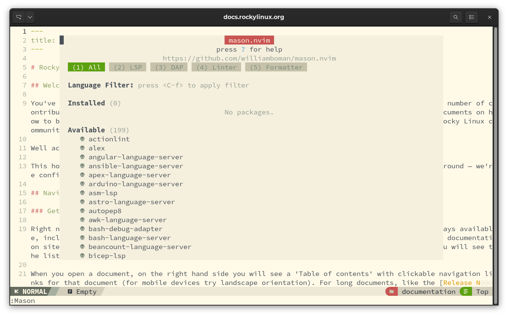

To learn about all available commands, simply press the <kbd>g?</kbd> key to have the full legend available.

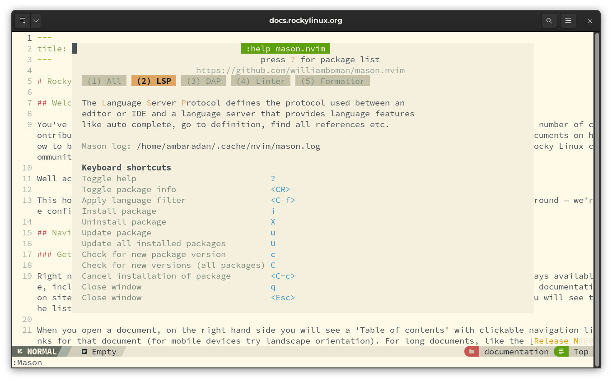

### Introduction to *nvim-lspconfig*

*nvim-lspconfig* is a collection of configurations, provided by the community, for the language client server built into the Nvim core. This plugin provides four main features:

- default startup commands, initialization options, and settings for each server.
- a root directory solver that attempts to locate the root of the project
- an automatic command mapping that launches either a new language server, or a language server for each open buffer if it is part of a traced project.
- utility commands such as LspInfo, LspStart, LspStop, and LspRestart, for managing language server instances.

The combined use of the two plugins allows the required language servers to be downloaded and automatically configured by NvChad.

#### Downloading Language Servers

To download the language server of choice, we open the interface of *Mason* from our editor with the command <kbd>SHIFT</kbd> + <kbd>:Mason</kbd>. Suppose we want to install the language server for *Markdown*. To do so, we type <kbd>2</kbd> to take us to the `LSP` section. Now we go down with the arrow key until we find the language server `marksman`. By pressing the space bar we can get some information about the server as you can see in the screenshot below.

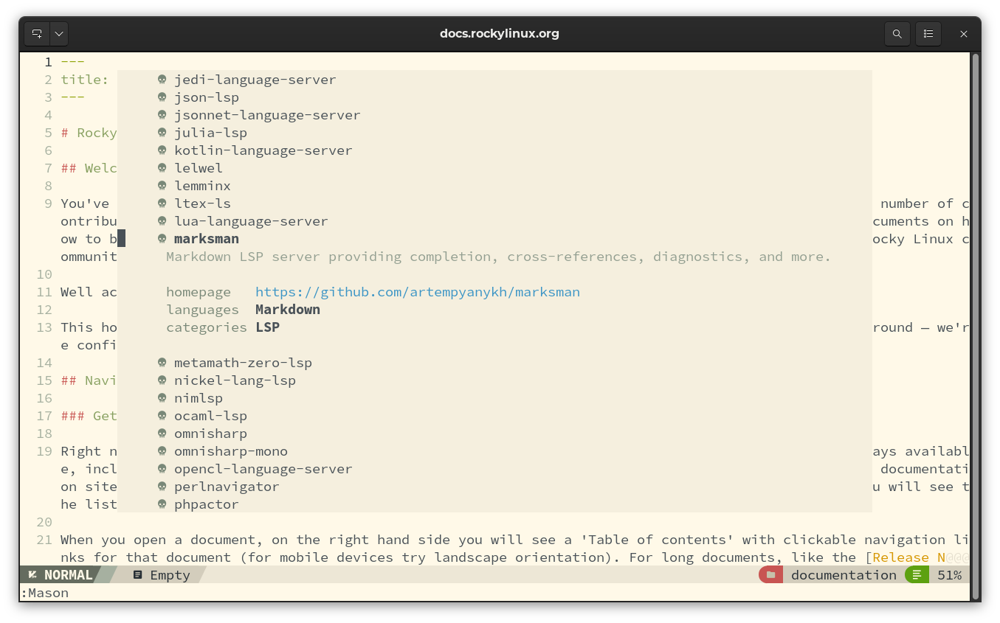

To install the server, simply press the <kbd>i</kbd> key, and after Mason completes the installation we will find it among the installed servers.

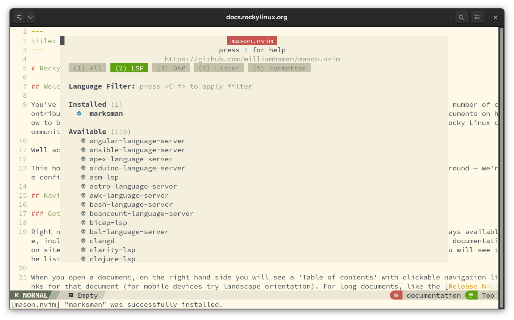

The servers to be installed by this procedure are:

- **marksman**: for markdown support
- **yaml-language-server**: for frontmatter support
- **lua-language-server**: for lua support
- **html-lsp**: for HTML support

### Configure `lspdconfig.lua`

Installed servers are not yet configured in NvChad. To perform server registration we need to perform additional configuration.

First we create the `custom/plugins` folder in `~/.local/nvim/lua`. Note that if you are following along completely, this path may already be created:

```bash
mkdir -p ~/.local/nvim/lua/custom/plugins
```

We used the `-p` flag since we want to create the entire path if it doesn't already exist. Once the folder is created, we need to create two files: `init.lua`, which will take care of instructing *Packer* to install the plugin, and `lspconfig.lua`, which will define our servers. 

Let's start by creating the two files first:

```bash
touch ~/.config/nvim/lua/custom/plugins/init.lua
touch ~/.config/nvim/lua/custom/plugins/lspconfig.lua
```

The folder structure at this point should look as follows:

```text
└── plugins
    ├── init.lua
    └── lspconfig.lua
```

We now move on to edit the two files to include support for *Language Servers*.

#### init.lua

Inserting the following code tells Packer to install the `neovim/nvim-lspconfig` plugin using the code contained in *nvim/lua/plugins/lspconfig.lua* and *nvim/lua/custom/plugins/lspconfig.lua* respectively. For configuration, through, we need `require` calls. Special attention should be paid to the sequence of the calls as they use the override technique, and reversing the order could result in inconsistencies in the configuration.

```lua
return {
  ["neovim/nvim-lspconfig"] = {
    config = function()
      require "plugins.configs.lspconfig"
      require "custom.plugins.lspconfig"
    end,
    },
}
```

We then go on to edit our file with NvChad:

```text
nvim ~/.config/nvim/lua/custom/plugins/init.lua
```

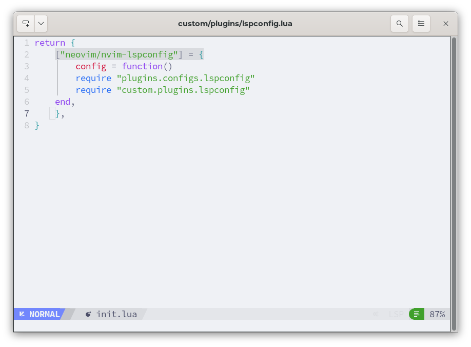

Once the changes are finished, we save the file with the command <kbd>SHIFT</kbd> + <kbd>:wq</kbd>.

We can now edit the configuration file of our local servers.

#### lspconfig.lua

This is our `lspconfig.lua` configuration file, and it is inserted after the NvChad *lspconfig* configuration has finished setting up the environment.

```lua
-- custom.plugins.lspconfig
local on_attach = require("plugins.configs.lspconfig").on_attach
local capabilities = require("plugins.configs.lspconfig").capabilities

local lspconfig = require "lspconfig"
local servers = { "html", "marksman", "yamlls"}

for _, lsp in ipairs(servers) do
  lspconfig[lsp].setup {
    on_attach = on_attach,
    capabilities = capabilities,
  }
end
```

Let's open our editor again and edit the file:

```textile
nvim ~/.config/nvim/lua/custom/plugins/lspconfig.lua
```

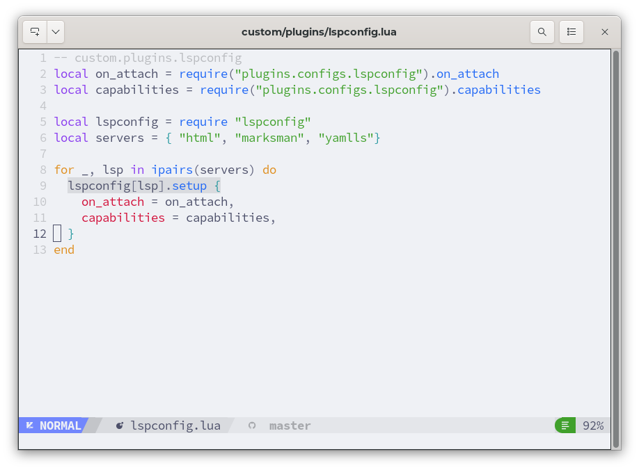

After finishing the changes we save and close the editor as before with <kbd>SHIFT</kbd> + <kbd>:wq</kbd>.

As we can see, we have added to the table of `local servers` the servers we have installed with *Mason*:

```lua
local servers = { "html", "marksman", "yamlls"}
```

This gives *nvim-lspconfig* a way to retrieve the configurations needed for their operation in the IDE.

Once we have finished the changes, to make them effective we need to tell *Packer* to synchronize them. This is done with a simple <kbd>SHIFT</kbd> + <kbd>:PackerSync</kbd> at the end of which the new installation of *neovim/nvim-lspconfig* will be highlighted in the log. Now opening a Markdown file should bring up a gear icon in the lower right corner and say `LSP - marksman`.

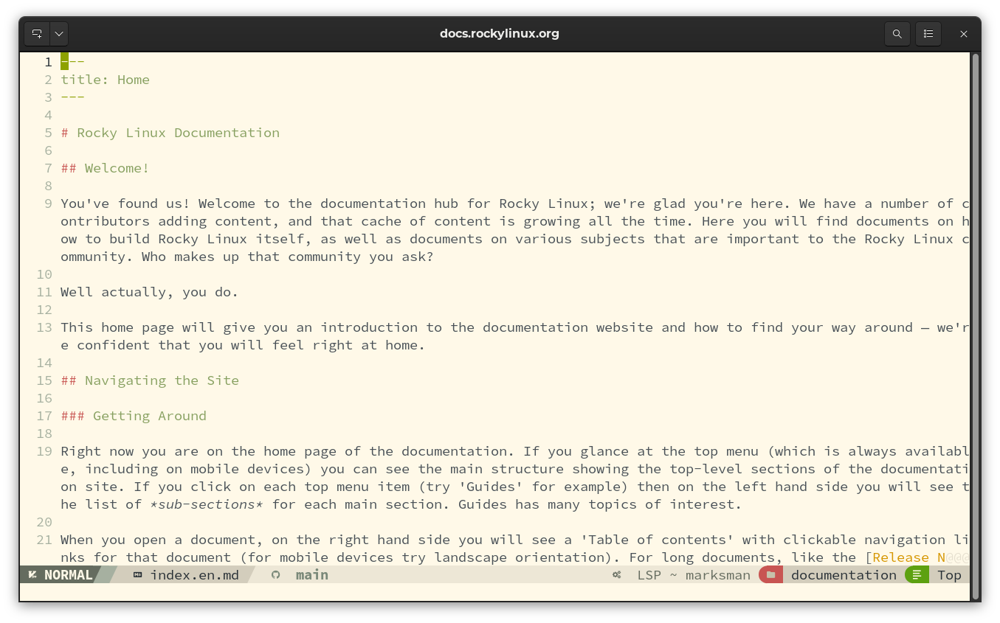

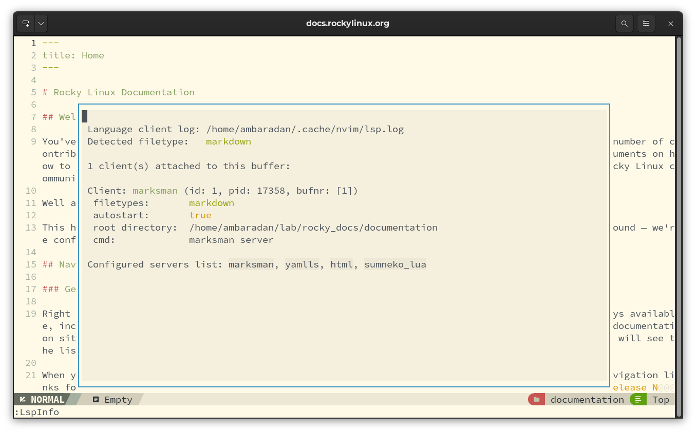

### Introduction to Used LSP

#### SumnekoLua

A very important component is the `lua-language-server`, which completely changes the experience of writing Lua code, and consequently also the editing of NvChad configuration files that are written in this language. This is also the default LSP for *lua* 

The executable is provided by the [SumnekoLua](https://github.com/sumneko/lua-language-server).

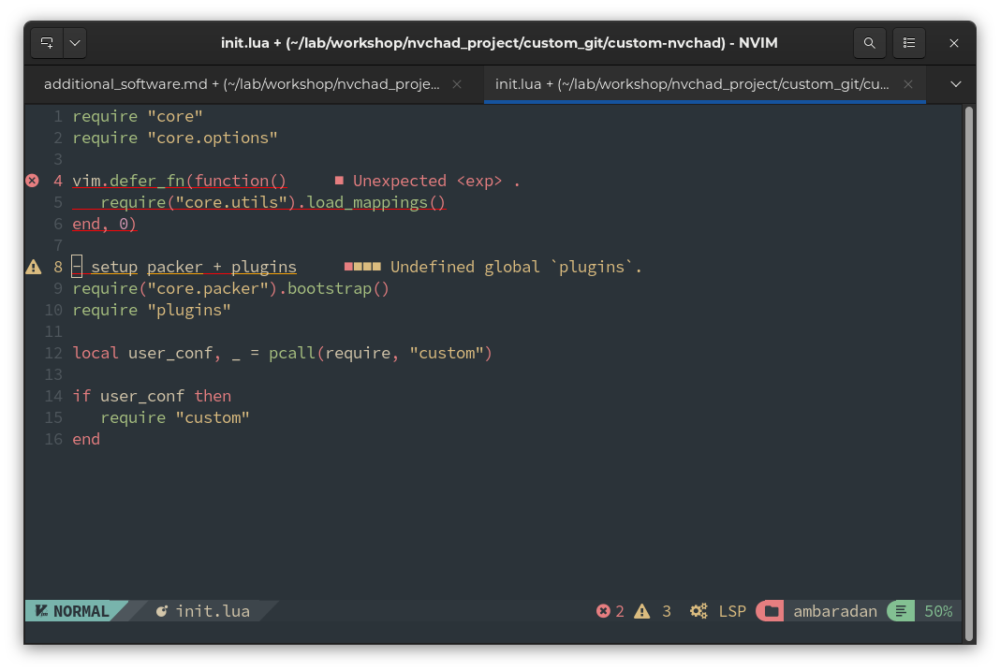

It should be noted that the lua server does not need to be configured in the `lspconfig.lua` configuration file. Since it is the default server for NvChad, this works without the need of any additional configuration.

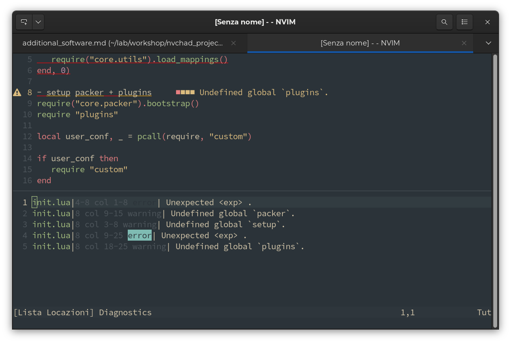

#### Marksman

Marksman is a language server for Markdown that provides auto-completion, go-to definitions, reference searching, diagnostics, etc. All types of links support completion, hover, and goto/reference definition. In addition, Marksman provides diagnostics for wiki links to detect broken references and duplicate/ambiguous titles.

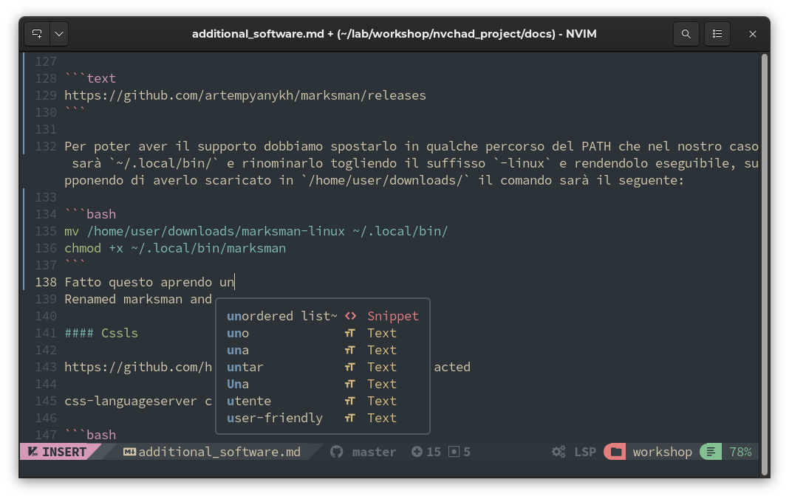

And if we try to create some errors, (in our example we will create a few blank lines that in markdown are not an error but are considered as bad formatting), we will get a visual warning (the pink squares to the left of the line number) that will alert us of the problem.

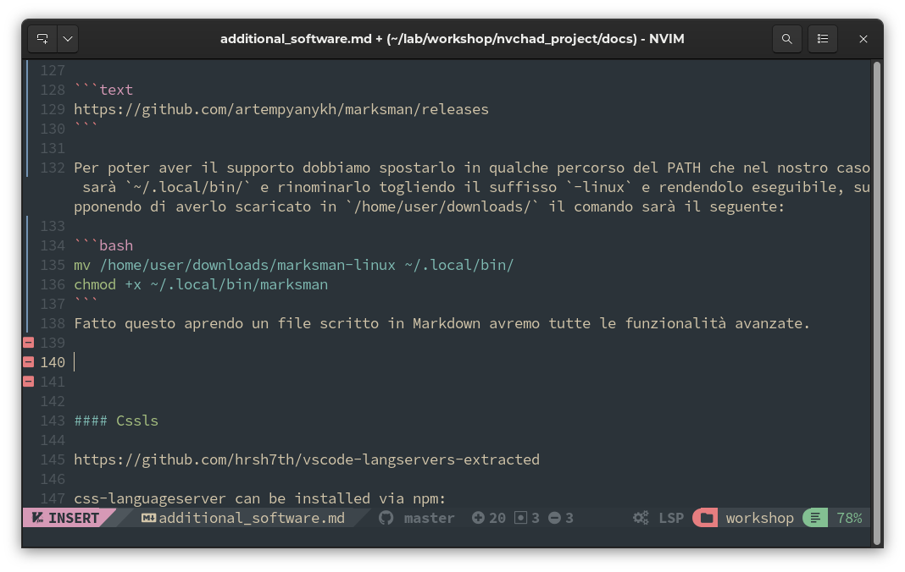

#### yamlls

`yamlls` provides functions to validate the entire yaml file, check for errors and warnings regarding code, autocomplete commands, plus hovering over a node displays the description, if available.

The language server is provided by the package [yaml-language-server](https://github.com/redhat-developer/yaml-language-server).

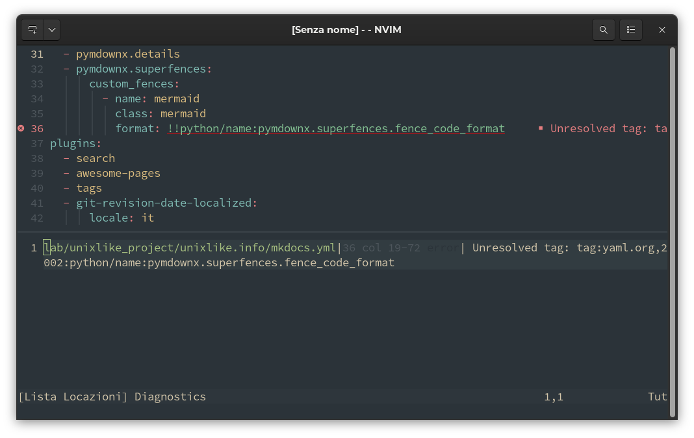

Once installed it will spring into action whenever we open a `.yaml` file by making a valuable contribution to writing and debugging code.

### Final Considerations

The use of LSPs greatly aids the editing process, enriching it with advanced features. It also allows us to keep track of its consistency in real time. It is definitely a tool to have in our IDE.

The introduction of *Mason*, although some manual intervention is still required to configure the environment, has made available an automated procedure for the installation of language servers. More importantly, it allows us to avoid the periodic checks for updates that would have been necessary in the case of manual installation. Once installed and configured, all our servers will be upgradeable from the *Mason GUI* with a simple press of the <kbd>U</kbd> key.
