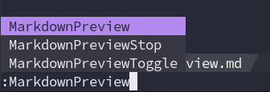
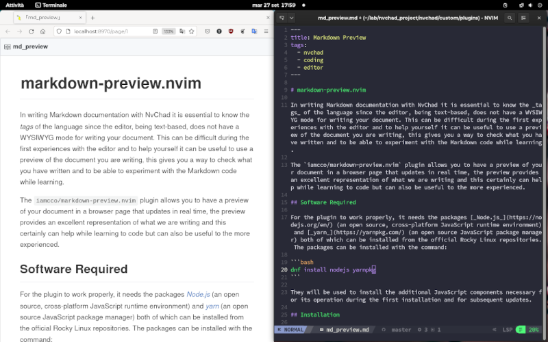

# markdown-preview.nvim

In writing Markdown documentation with NvChad it is essential to know the _tags_ of the language since the editor, being text-based, does not have a WYSIWYG mode for writing your document. This can be difficult during the first experiences with the editor and to help yourself it can be useful to use a preview of the document you are writing, this gives you a way to check what you have written and to be able to experiment with the Markdown code while learning.

The `iamcco/markdown-preview.nvim` plugin allows you to have a preview of your document in a browser page that updates in real time, the preview provides an excellent representation of what we are writing and this certainly can help while learning to code but can also be useful to the more experienced.

## Software Required

For the plugin to work properly, it needs the packages [_Node.js_](https://nodejs.org/en/) (an open source, cross-platform JavaScript runtime environment) and [_yarn_](https://yarnpkg.com/) (an open source JavaScript package manager) both of which can be installed from the official Rocky Linux repositories. The packages can be installed with the command:

```bash
dnf install nodejs yarnpkg
```

They will be used to install the additional JavaScript components necessary for its operation during the first installation and for subsequent updates.

## Installation

The installation of the plugin passes, as with all plugins, by a modification of the file `custom/plugins/init.lua`. The code to be inserted is as follows:

```lua
  ["iamcco/markdown-preview.nvim"] = {
    ft = { "markdown" },
    run = "cd app && yarn install",
  },
```

Analyzing the code we can say that the first line instructs _Packer_ about the plugin to be installed, the second specifies the type of file that needs the plugin to be loaded, and the third executes a series of post-installation commands. In particular, the `run` option in this case executes the command as a shell command (set in the system variable $SHELL), the `run` command by default always uses the plugin folder as its source, so in this case it is located in the _app_ folder subsequently executing the `yarn install` command.

Once the changes have been made we have to close the editor and reopen it, this is to give it a chance to reload the configuration. Now you can install and configure the _plugin_ with the `:PackerSync` command.

## Using the Plugin

{ align=right }

Once installed we will have three commands for managing the preview, the commands will be active only if we have a _markdown_ file in the buffer, and they are as follows:

- **:MarkdownPreview** with this command the preview is started, a default browser page is opened, and a _html_ server is started
- **:MarkdownPreviewStop** command ends the preview and the browser page is closed
- **:MarkdownPreviewToggle** allows you to switch the display from _light_ to _dark_

The preview is also closed if you close the corresponding buffer (for example, with <kbd>Space</kbd> + <kbd>x</kbd>).

## Mapping

The plugin can be easily integrated into NvChad with a custom mapping, to do so we can put the following code in the `custom/mapping.lua` file

```lua
M.mdpreview = {
  n = {
    ["<leader>pw"] = { "<cmd> MarkdownPreview<CR>", "Open Markdown Preview" },
    ["<leader>px"] = { "<cmd> MarkdownPreviewStop<CR>", "Close Markdown Preview" },
  },

  i = {
    ["<A-p>"] = { "<cmd> MarkdownPreview<CR>" },
    ["<A-x>"] = { "<cmd> MarkdownPreviewStop<CR>" },
  },
}
```

The first array sets the shortcuts for NORMAL mode ( n = { ) and allows you to select the two commands of _markdown-preview.nvim_ by typing <kbd>Space</kbd> + <kbd>p</kbd> followed by the letter corresponding to the desired command.


The second array sets them for INSERT mode ( i = { ) allowing us to activate it while editing the document. Since in INSERT mode the <kbd>Space</kbd> key cannot be used for the shortcut we moved the command to <kbd>Alt</kbd>, the <kbd>Space</kbd> key in INSERT mode is interpreted as a space to be inserted within the document and therefore cannot be used within the shortcuts.

We will then activate the preview with the combination <kbd>Alt</kbd> + <kbd>p</kbd> and close it with <kbd>Alt</kbd> + <kbd>x</kbd>.

## Visualization

The developers of the plugin have included two themes in the css stylesheet that is used, one light and one dark. To select the desired theme there is a hidden button located at the top right of the page, bringing the mouse to that location should cause the button to appear as shown in the screenshot below.


Selecting the dark theme switches the display to:


There is also the option of using your own css stylesheet to have a display that is as close as possible to the document you are writing, the path to your _css_ must be set in the `mkdp_markdown_css` variable, and you can also specify your own _css_ file for highlighting code in `mkdp_highlight_css`. Both paths must be absolute paths (Ex. /home/user/your_css.css).

For a temporary change we can set the dark theme directly in _NvChad_ by entering the following command in the statusline:

```text
:let g:mkdp_theme = 'dark'
```

## Conclusion

The _iamcco/markdown-preview.nvim_ plugin provides a preview of the markdown document we are writing allowing us to check the result in real time, the commands can be easily integrated into the NvChad mapping for a faster workflow, also there is the possibility to customize the preview view using your own css stylesheet. More information can be found on the [Project Page](https://github.com/iamcco/markdown-preview.nvim).


