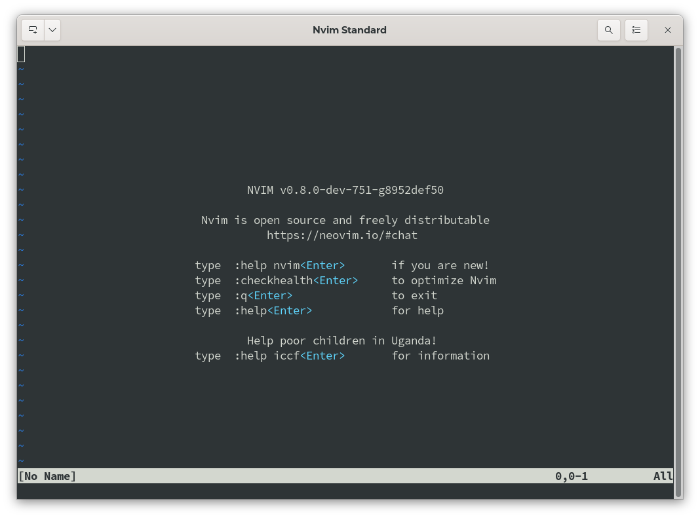

## Introduction to Neovim

Neovim is one of the best code editors due of its speed, ease of customization, and configuration.

Neovim is a fork of the `Vim` editor. It was born in 2014, mainly due to the lack at the time of asynchronous support in Vim. Written in the Lua language with the goal of modularizing the code to make it more manageable, Neovim was designed with the modern user in mind. As the official website states, "Neovim is built for users who want the best parts of Vim, and more".

The developers of Neovim chose Lua as it was perfect for embedding, using LuaJIT quickly, and with a simple, scripting-oriented syntax.

From version 0.5 Neovim includes Treesitter (a parser generator tool) and supports Language Server Protocol (LSP). This reduces the number of plugins needed to achieve advanced editing functions. It improves the performance of operations such as code completion and linting.

One of its strengths is its customization. All of its configuration is contained in a single file that can be distributed to the various installations through a version manager (Git or other) so that the various installations are always synchronized.

### Community of developers

Although Vim and Neovim are both open-source projects and hosted on GitHub, there is a significant difference between the modes of development. Neovim has a more open community development, while Vim's development is more tied to the choices of its creator. Neovim's user and developer base is quite small compared to Vim, but it is a continuously growing project.

### Key Features

- Performance: Very fast.
- Customizable: Wide ecosystem of plugins and themes 
- Syntax highlighting: Integrated with Treesitter and LSP, but requires some configuration 

As with Vim, Neovim requires a basic knowledge of its commands and options. You can get an overview of its features through the `:Tutor` command that invokes a file where you can read, and practice using it. Learning takes longer than a fully graphical IDE, but once you learn the shortcuts to the commands and the included features, you will proceed very smoothly in editing documents.

 

## Neovim Installation

### Installation from EPEL

Before moving on to the installation of NvChad, we need to make sure that we have an installation of Neovim available. If it is not already installed, you can install it from the EPEL Repository, even if the version provided does not meet the minimum requirements.

To install the Neovim release provided by EPEL, we install if you have not already done so the repository.

```bash
dnf install epel-release
```

And we type the following command to install the application:

```bash
dnf install neovim
```

### Installation from Precompiled Package

In order to meet the minimum requirements of NvChad, it is suggested that you install the precompiled package provided by Neovim instead. This solves the problem of the version provided by EPEL (currently 0.7.0.1), which does not meet the minimum requirement.

In order to use all the features of the new version, we still have to satisfy the dependencies required by Neovim. If we decide to remove or not install the outdated version from EPEL at all, we have to provide _our_ `nvim` with the dependencies manually. The required packages can be installed with:

```bash
dnf install compat-lua-libs libtermkey libtree-sitter libvterm luajit luajit2.1-luv msgpack unibilium xsel
```

Next, we download the compressed archive for our architecture (linux64) from this address:

```text
https://github.com/neovim/neovim/releases
```

The file to be downloaded is `nvim-linux64.tar.gz`, to verify the integrity of the archive we also download the file `nvim-linux64.tar.gz.sha256sum`, once downloaded we need to verify its integrity and unpack it somewhere in our `home directory`. The proposed solution is to unpack it in `~/.local/share/`, assuming we downloaded it in _/home/user/downloads/_ we will need to run the following commands:

```bash
sha256sum -c /home/user/downloads/nvim-linux64.tar.gz.sha256sum
nvim-linux64.tar.gz: OK

tar xvzf /home/user/downloads/nvim-linux64.tar.gz
mv /home/user/downloads/nvim-linux64 ~/.local/share/nvim-linux64
```

All that remains at this point is to create a symbolic link in `~/.local/bin/` for our _nvim_.

```bash
cd ~/.local/bin/
ln -sf ~/.local/share/nvim-linux64/bin/nvim nvim
```

To be shure, we check the version provided by the `nvim -v` command, which should now show:

```txt
nvim -v
NVIM v0.7.2
Build type: Release
LuaJIT 2.1.0-beta3
Compiled by runner@fv-az164-457

Features: +acl +iconv +tui
See ":help feature-compile"

   system vimrc file: "$VIM/sysinit.vim"
  fall-back for $VIM: "/share/nvim"

Run :checkhealth for more info
```

As you can see from the screenshot, a basic installation of Neovim provides an editor that cannot yet be compared to an IDE.



Now that we have our basic editor, it is time to turn it into something more advanced thanks to the configuration provided by [NvChad](install_nvchad.md).
