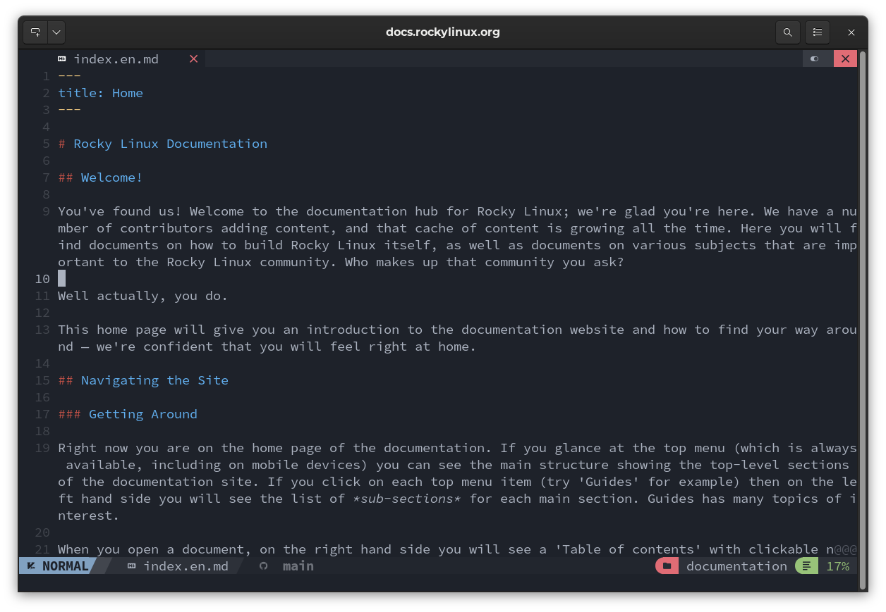
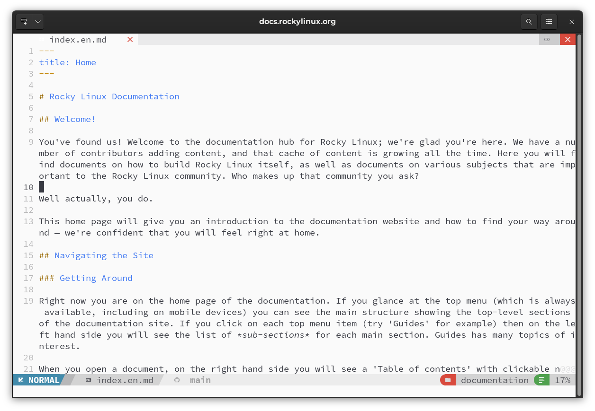
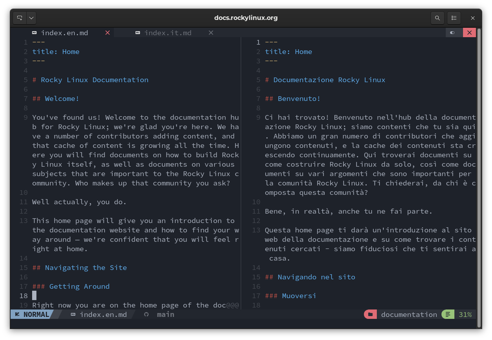
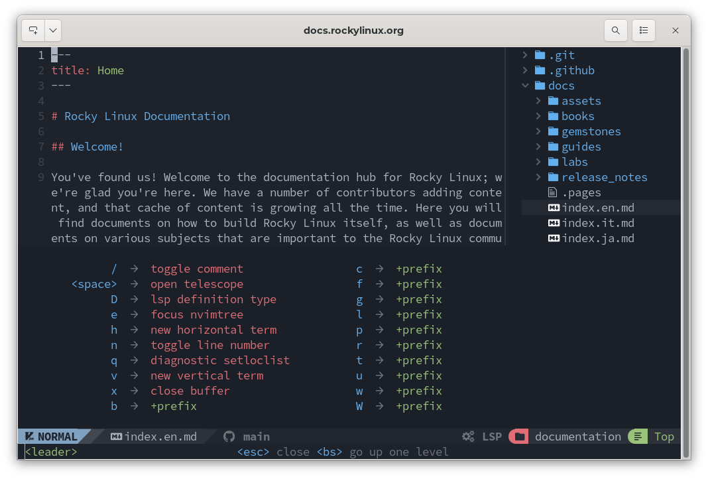
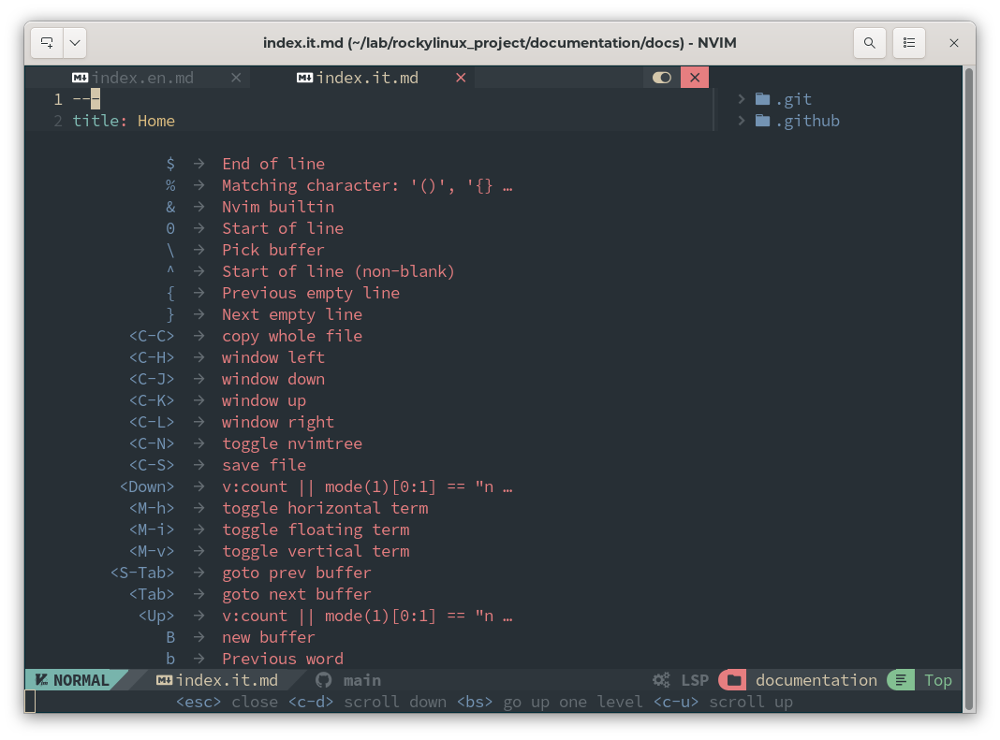
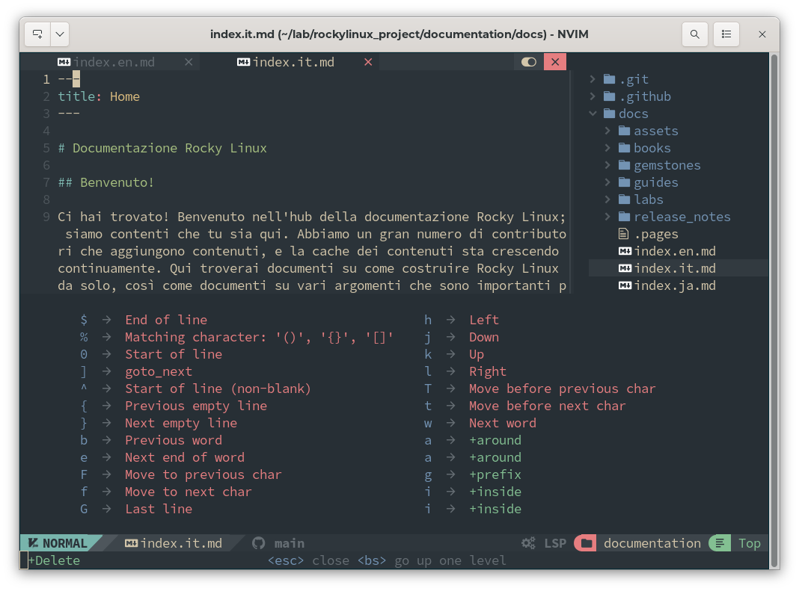
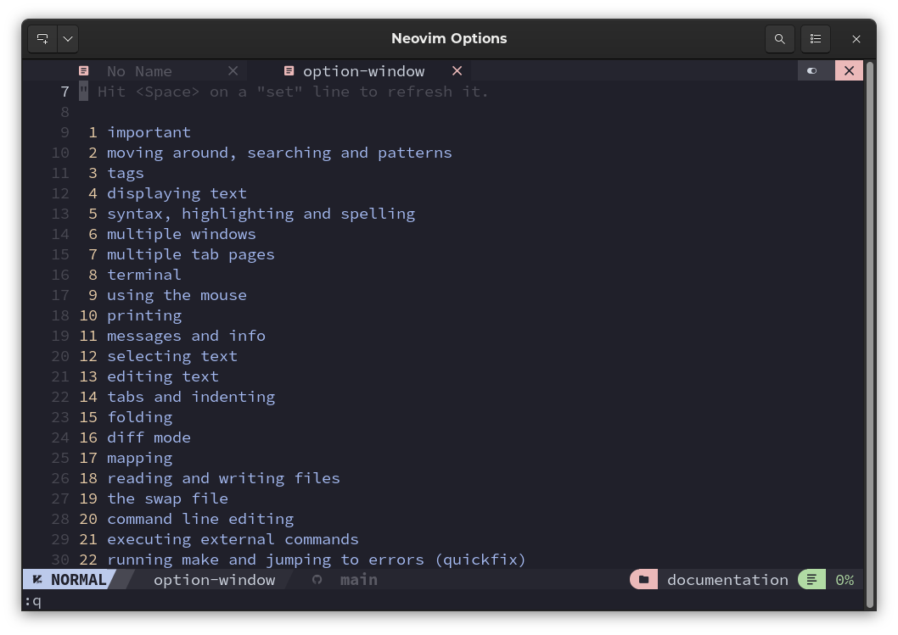
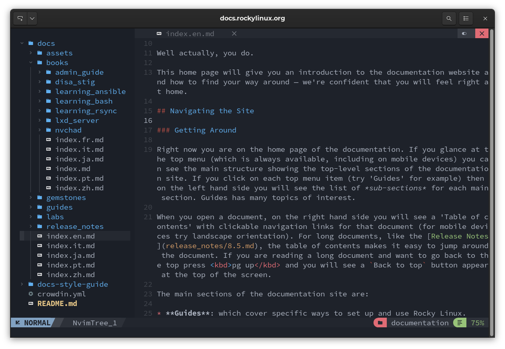

# NvChad UI

## NvChad Interface

Once Neovim is installed and the NvChad configuration is entered, our IDE should look like this:

The interface already comes with some advanced functionality (such as indicating the status of the git repository) but can be further enhanced by using, for example, the [Language Servers](lsp.md) and customized by overriding some basic configurations. The basic modules that make it up are:

### Tabufline

The user interface presents a top bar called `Tabufline` where the open buffers are managed. The open buffer presents the file type icon, the file name and its status. Status is indicated with an icon. If as in the screenshot we have a red `x` it means that the file can be closed as it is already saved. If instead the icon is a green dot `.`, then the file needs to be saved, and a close command <kbd>:q</kbd> will produce a warning about saving to be done before the buffer is closed.

To the right is the icon for setting the *dark* or *light* theme. By clicking on it with the mouse, we can select the chosen theme.

On the right also we have the icon for closing our editor.

### Middle Section - Open Buffers

The central part of the editor is composed of the buffer active on the editor at that moment (*index.en.md*). To anticipate some additional functionality we can work simultaneously on several buffers by opening one more in the example (*index.en.md*). In the editor we will have the first buffer in the foreground and the second one listed in the Tabufline. Now if we split the first buffer with the `:vsplit` command and select the right buffer, clicking on the name of the second file (*index.it.md*) in the tabufline, this will be opened in the right buffer and we can work with the two files side by side.

### Statusline

At the bottom we find the Statusline, which handles status information. On the right we find the editor status. We must not forget that we are using a text editor and that, in particular, it maintains the philosophy and operation of Vim. The possible states are:

- **NORMAL**

- **INSERT**

- **COMMAND**

- **VISUAL**

Editing a document starts from the **NORMAL** state where you open the file, switch to **INSERT** mode for editing, and when finished exit with <kbd>ESC</kbd> and return to **NORMAL** mode. Now to save the file you switch to **COMMAND** mode by typing `:` in the statusline followed by `w` (*write*) to write it and with <kbd>ESC</kbd> you return to **NORMAL** mode. The status indication is very useful while learning how to use it, particularly if one is not very familiar with the Vim workflow.

We then find the name of the open file, and if we are working on a git repository, we will have indications of the status of the repository. This is thanks to the *lewis6991/gitsigns.nvim* plugin.

Turning to the right side we find the indication of the folder from which we opened the editor. In the case of the use of LSPs, this indicates the folder that is taken into account as `workspace`, and consequently evaluated during diagnostics, and to follow the position of the cursor within the file.

### Integrated Help

NvChad and Neovim provide some useful commands for displaying preset key combinations and available options.

If the `<escape>` key alone is pressed it will provide a legend of associated commands as in the following screenshot:

To view all the commands included in the editor we can use the `<leader>wK` command, which will give the following result:

and by pressing <kbd>d</kbd> we can display the remaining commands:

As we can see, almost all the commands refer to navigation within the document or buffer. No commands for opening the file are included. These are provided by the Neovim commands.

To view all of Neovim's options, the `:options` command is available, which will present a tree of options indexed by category.

This gives us a way, through the built-in help, to learn the commands while using the editor, and also to delve into the available options.

### NvimTree

In order to work with our files we need a File Explorer, and this is provided by the *kyazdani42/nvim-tree.lua* plugin. With the combination <kbd>CTRL</kbd> <kbd>n</kbd> we can open NvimTree.

As we can see below, after NORMAL the open file is not shown but instead the buffer with NvimTree. In case we are not in the right buffer, we can use the <kbd>leader</kbd> <kbd>e</kbd> command provided by NvChad to switch the focus on NvimTree.

Once positioned, we will have a series of commands for working on the file tree. The most common commands are:

- <kbd>></kbd> e <kbd><</kbd> to navigate up and down the tree (mouse support for navigation is also active)
- <kbd><CR></kbd> o <kbd>o</kbd> to open the file in the buffer, subsequent openings of other files will always be done on the same buffer in a new tab but placed in the backgroud, to change the default behavior you can use the following keys: to navigate up and down the tree (mouse support for navigation is also active)
- <kbd><CR></kbd> o <kbd>o</kbd> to open the file in the buffer, subsequent openings of other files will always be done on the same buffer in a new tab but placed in the backgroud, to change the default behavior you can use the following keys:
    - <kbd>CTRL</kbd> <kbd>v</kbd> to open the new file in the vertically divided buffer
    - <kbd>CTRL</kbd> <kbd>x</kbd> to open the new file in the horizontally split buffer
    - <kbd>CTRL</kbd> <kbd>t</kbd> to open the new file in a new tab in a new buffer
- <kbd>R</kbd> to refresh files
- <kbd>a</kbd> to create a new file
- <kbd>r</kbd> to rename a file
- <kbd>d</kbd> to delete a file
- <kbd>q</kbd> to close the explorer

All available commands can be viewed on [this page](https://github.com/kyazdani42/nvim-tree.lua/blob/master/doc/nvim-tree-lua.txt) of the NvimTree project in section *6. Mappings*.

Now that we have explored the interface components we can move on to using NvChad.
