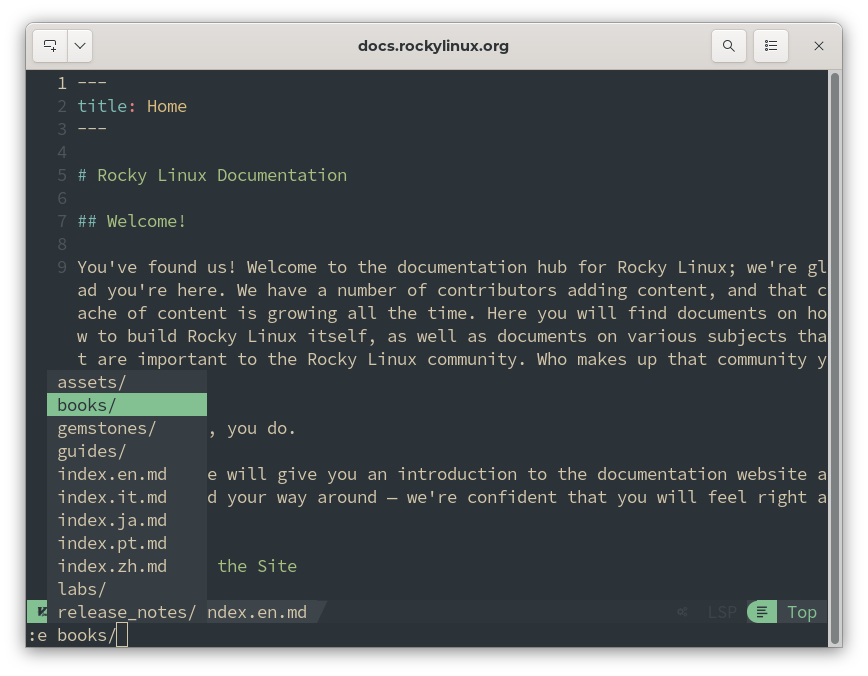
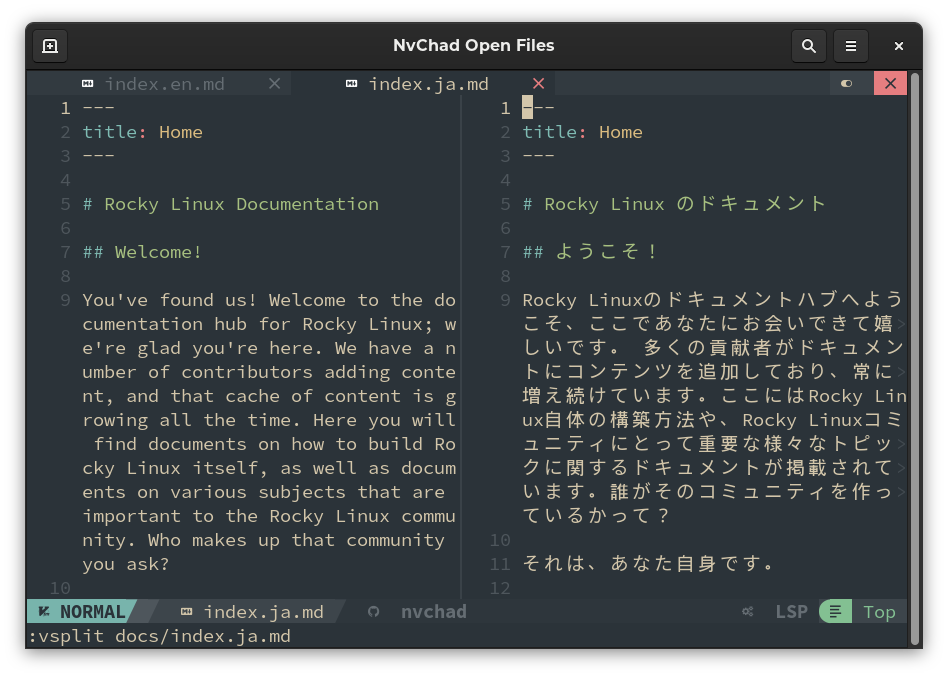
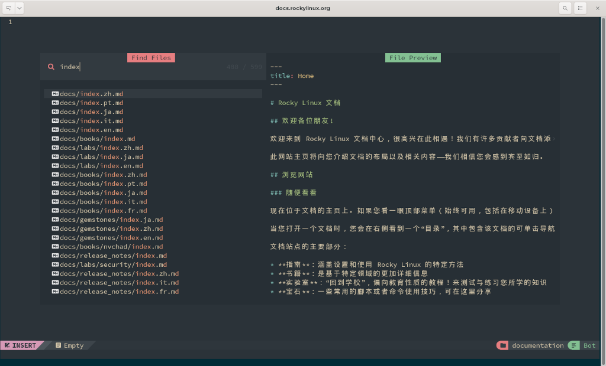
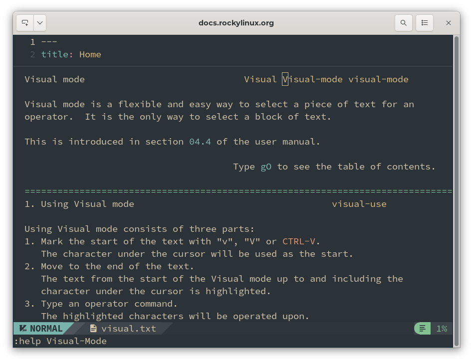
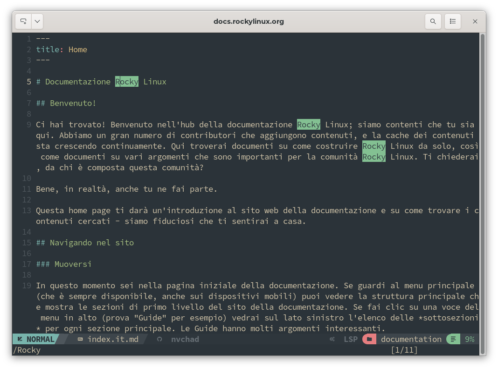

# Editing with NvChad

This document will introduce some NvChad-specific commands and some standard Neovim (vim) commands. The NvChad commands are set in the `nvim/lua/core/mapping.lua` file and allow keys to be used to execute sometimes very long composite commands. All sequences are started by a main key followed by the specific options. The four main keys are:

- C = <kbd>Ctrl</kbd>

- leader = <kbd>Space</kbd>

- A = <kbd>Alt</kbd>

- S = <kbd>shift</kbd>

## Open a file

To open a file in our editor we can use various methods, we can simply start from the command line by indicating the file name with:

```bash
nvim /path/to/the/file
```

Or open the editor with the `nvim` command.

At this point we have several possibilities, we can open the file in the buffer with the command `:e` (edit) followed by the path or by having the command followed by the <kbd>Tab</kbd> key which will show us all the available files and folders starting from the root of the project, about the <kbd>Tab</kbd> key it is good to remember that all file opening commands followed by *Tab* provide the possibility to select the file from a convenient drop-down menu, after opening the menu we continue to navigate within it with the <kbd>Tab</kbd> key.

 

In case we just want to view the file without the ability to edit it we can use the `:view` command which will open the file in read-only mode thus avoiding, for example, making unwanted changes to critical files. We can also open a file side by side with the command ` :split ` or open it in a new *tab* with the command ` :tabedit `.



Thanks to the work done by the developers of NvChad we are provided with an additional way to open a file which is to use the *nvim-telescope/telescope.nvim* plugin, this plugin when used in combination with *RipGrep* allows us to search for the file to be opened in interactive mode, upon typing the initial characters of the file we are looking for the plugin will delete all non-matching files and present us with only those that match our search, this allows for very smooth searching and opening of files.

 

## Working with the Editor

Once the file is open we can start editing it, to do this we need to switch to INSERT mode which is activated by pressing the <kbd>i</kbd> (insert) key. The mode indicator in the Statusline should change from NORMAL to INSERT and the cursor placed in the buffer should also change from a colored rectangle to a `|` pipe. Now all the characters we type are inserted into the document starting from the cursor position, to move the cursor in INSERT mode the Nvchad developers have set up some convenient mappings which are:

- `<C-b>` to go to the beginning of the line
- `<C-e>` to go to the end of the line
- `<C-h>` to move one character to the left
- `<C-l>` to move one character to the right
- `<C-j>` to go to the next line
- `<C-k>` to go to the previous line

As specified above the key `C` corresponds to the <kbd>Ctrl</kbd> key so to go to the previous line will be the combination of <kbd>Ctrl</kbd> + <kbd>k</kbd>.

Learning all the combinations takes some time but once acquired they will make navigation very fast. For example, if we want to edit the end of the next line to where the cursor is positioned we can get to the end of the current line with `<C-e>` and then get to the next one with a `<C-j>` and already be in position to add the changes.

Navigation in the document can also be done using the arrow keys on the keyboard, or the mouse.

### Text Selection

Text selection can also be done with the mouse and is very convenient but for this guide we will use the traditional method.

To select text we need to enter the VISUAL mode, to do this we must first exit the insert mode and switch to normal mode, this operation is done with the <kbd>ESC</kbd> key, once we place the cursor at the beginning of the part we want to select with the combination of the keys <kbd>Ctrl</kbd> + <kbd>v</kbd> we enter the V-BLOC (Visual Block) mode, now moving with the cursor we will see that our selection will be highlighted, at this point we can work on the selected part. If we want to copy the selection to the clipboard we will use the <kbd>y</kbd> key, if we want to delete it the <kbd>d</kbd> key, once the operation is done the text will no longer be highlighted. For an overview of all the operations that can be performed in Visual Mode you can consult the help directly from the editor with `:help Visual-Mode`.

 

### Text search

To search, the slash character <kbd>/</kbd> followed by the search key `/search_key` is used, which highlights all occurrences found, to move to the next one the combination <kbd>/</kbd> + <kbd>Enter</kbd> is used, while to move to the previous one <kbd>?</kbd> + <kbd>Enter</kbd>, once the changes are finished, the highlighting is removed with the command `:noh` (no highlight).



Searches can be even much more complex than the one illustrated above; wildcards, counters, and other options can be used. The help `:help /` can be used to consult the options.

## Saving the Document

Once the file is created or modified it is saved with the command `:w` (write) which will save the file with the current name in the location it is in, in case you want to save the file with another name or in another location just have the command follow the save path:

```text
:w /path/to/new/file_or_position
```

To save and simultaneously close the editor, the command `:wq` (write - quit) is used.

In this section we have made only an introduction to the use of the editor which has much more advanced features than those described, these features can be consulted on the [Neovim help](https://neovim.io/doc/user/) page or by typing in the editor `:help`.

