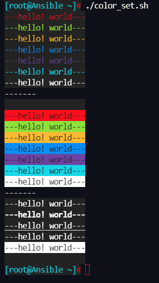

# Introduction

When we download bash scripts that have been written by others in our daily work, sometimes some key strings are marked with special colors, How can this effect be achieved by writing in a script?

## Font color

| **color code** | **describe** |
|    :---:       |    :---:     |
|  30            |    black     |
|  31            |     red      |
|  32            |    green     |
|  33            |    yellow    |
|  34            |     blue     | 
|  35            |     purple   |
|  36            |   Dark green |
|  37            |    white     |

## Background color of font

| **Background color code** | **describe** |
|    :---:       |    :---:     |
|     40         |    black     |
|     41         |    Crimson   |
|     42         |    green     |
|     43         |    yellow    |
|     44         |    blue      |
|     45         |    purple    |
|     46         |  Dark green  |
|     47         |   white      |

## Display mode

| **code** | **describe** |
|  :---:   |    :---:     |
|    0     |Terminal default settings|
|    1     |Highlight|
|    4     |Underline|
|    5     |Currsor blinks|
|    7     |Reverse display|
|    8     | hide |

## Mode of execution

* **\033[1;31;40m**
"1" indicates the display mode, which is optional. "31" indicates the font color. "40m" indicates the font background color

* **\033[0m**
Restore the terminal default color, that is, cancel the color setting

## Script example

We can write a script to observe the color change.

```bash
#!/bin/bash
# Font color cycle
for color1 in {31..37}
    do
        echo -e "\033[0;${color1};40m---hello! world---\033[0m"
    done

echo "-------"

# Background color cycle
for color2 in {40..47}
    do
        echo -e "\033[30;${color2}m---hello! world---\033[0m"
    done

echo "-------"

# Cycle of display mode
for color3 in 0 1 4 5 7 8
    do
        echo -e "\033[${color3};37;40m---hello! world---\033[0m"
    done
```

```bash
Shell > chmod a+x color_set.sh
Shell > ./color_set.sh
```

The effect is as follows:

