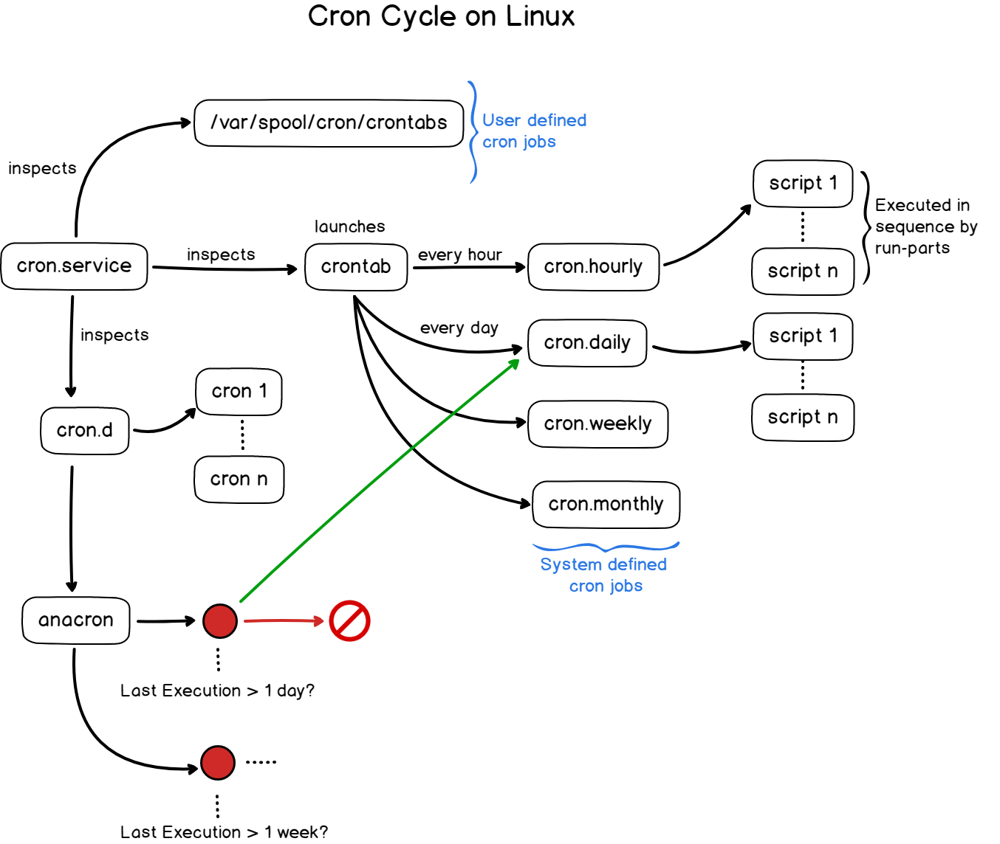

#  anacron- Run commands regularly

##  Prerequisites

* A machine running Rocky Linux.
* Know how to use your favorite editor to modify the configuration file (such as *vim* ) in the command line environment .
* Understand basic RPM package management

##  Assumption

* You have understood the basic knowledge of bash, python or other scripting/programming tools, and want to run the script automatically.
* You are logged in as the root user, or switch to root with `su - root`

##  Anacron Introduction
**anacron is used to run commands on a regular basis, and the operating frequency is defined in units of days. It is suitable for computers that do not run 24/7, such as laptops and desktops. Suppose you have a scheduled task (such as a backup script) to be run in the early morning of every day using crontab. When you fall asleep, your desktop/laptop is shut down. Your backup script will not be executed. However, if you use anacron, you can rest assured that the next time you turn on the desktop/laptop, the backup script will be executed. **

The appearance of anacron is not to replace crontab, but to complement crontab. Their relationship is as follows:



##  anacron configuration file

```bash
shell > rpm -ql cronie-anacron
/etc/anacrontab
/etc/cron.hourly/0anacron
/usr/lib/.build-id
/usr/lib/.build-id/0e
/usr/lib/.build-id/0e/6b094fa55505597cb69dc5a6b7f5f30b04d40f
/usr/sbin/anacron
/usr/share/man/man5/anacrontab.5.gz
/usr/share/man/man8/anacron.8.gz
/var/spool/anacron
/var/spool/anacron/cron.daily
/var/spool/anacron/cron.monthly
/var/spool/anacron/cron.weekly
```

First check the default configuration file:
```bash
shell > cat /etc/anacontab
# /etc/anacrontab: configuration file for anacron
# See anacron(8) and anacrontab(5) for details.
SHELL=/bin/sh
PATH=/sbin:/bin:/usr/sbin:/usr/bin
MAILTO=root
# Default 45 minutes delay for each specified job anacron random increase 0-45 minutes.
RANDOM_DELAY=45
# Specify the scope of work time, represented here 3:00 ~ 22:00
START_HOURS_RANGE=3-22
# period in days delay in minutes job-identifier command
# Boot every day to check whether the files in the directory /etc/cron.daily be executed in 5 minutes, if not executed today, then to the next
1 5 cron.daily nice run-parts /etc/cron.daily
# Every 7 days within 25 minutes if the file check /etc/cron.weekly directory is executed after boot, if not executed within a week, it will be executed next
7 25 cron.weekly nice run-parts /etc/cron.weekly
# Whether the files in the directory /etc/cron.monthly 45 minutes checking is performed after every start for a month
@monthly 45 cron.monthly nice run-parts /etc/cron.monthly
```

**/etc/cron.hourly/** -Through `journalctl -u crond.service`, you can know that the files put inside are actually called by crond.server, which means that the command will be executed after the first minute of every hour. As follows:

```bash
shell > cat /etc/cron.d/0hourly
# Run the hourly jobs
SHELL=/bin/bash
PATH=/sbin:/bin:/usr/sbin:/usr/bin
MAILTO=root
01 *  *  *  * root run-parts /etc/cron.hourly
```
```
shell > journalctl -u crond.service
- Logs begin at Wed 2021-10-20 19:27:39 CST, end at Wed 2021-10-20 23:32:42 CST. -
October 20 19:27:42 li systemd[1]: Started Command Scheduler.
October 20 19:27:42 li crond[733]: (CRON) STARTUP (1.5.2)
October 20 19:27:42 li crond[733]: (CRON) INFO (RANDOM_DELAY will be scaled with factor 76% if used.)
October 20 19:27:42 li crond[733]: (CRON) INFO (running with inotify support)
October 20 20:01:01 li CROND[1897]: (root) CMD (run-parts /etc/cron.hourly)
October 20 21:01:01 li CROND[1922]: (root) CMD (run-parts /etc/cron.hourly)
October 20 22:01:01 li CROND[1947]: (root) CMD (run-parts /etc/cron.hourly)
October 20 23:01:01 li CROND[2037]: (root) CMD (run-parts /etc/cron.hourly)

```

For more configuration file information, please [Browse the manual page](https://man7.org/linux/man-pages/man5/anacrontab.5.html)
# # User use
In order to make certain files run within these automatically defined times, all you need to do is to copy the script file to the relevant directory and make sure that it has ** x execution permission (chmod +x) ** . Therefore, you only need to let the system automatically run the script at one of these scheduled times, which makes the automation task very easy.
Let's use cron.daily to illustrate the execution process of /etc/anacrontab:

1. Anacron reads the ** /var/spool/anacron/cron.daily ** file, and the content of the file shows the time of the last execution.
2. Compared with the current time, if the difference between the two times exceeds 1 day, the cron.daily job will be executed.
3. This work can only be performed from 03:00-22:00.
4. Check whether a file is executed after 5 minutes after booting. When the first one is executed, it will be randomly delayed for 0～45 minutes to execute the next one.
5. Use the nice parameter to specify the default priority, and use the run-parts parameter to execute all executable files in the /etc/cron.daily/ directory.

# # Related commands
Use the command `anacron`, commonly used options are:

| Options | Description |
| --- | --- |
| -f | Execute all jobs, ignoring timestamps |
| -u | Update the timestamp to the current time without performing any action |
| -T | Test the validity of the configuration file /etc/anacrontab |

For more help information, please [Browse the manual page](https://man7.org/linux/man-pages/man8/anacron.8.html)
