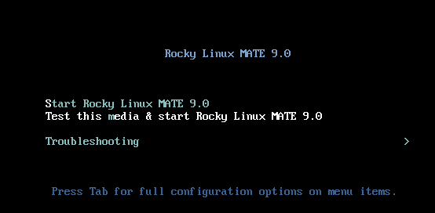
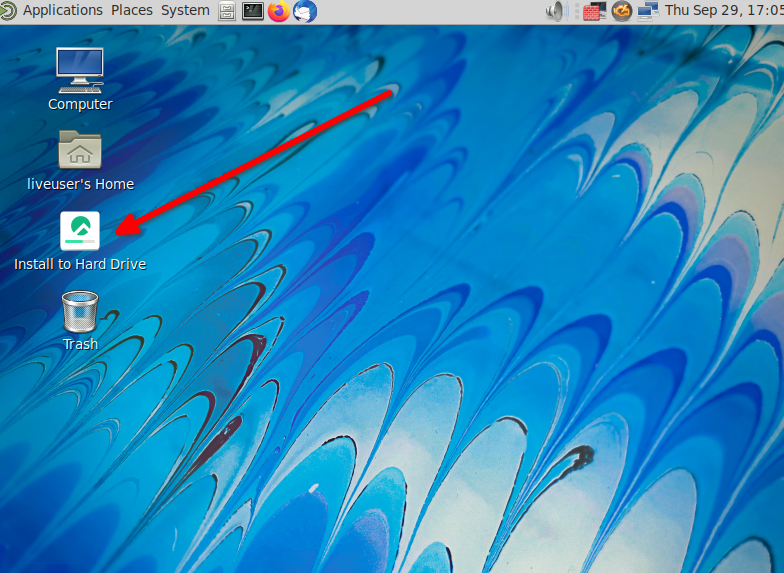
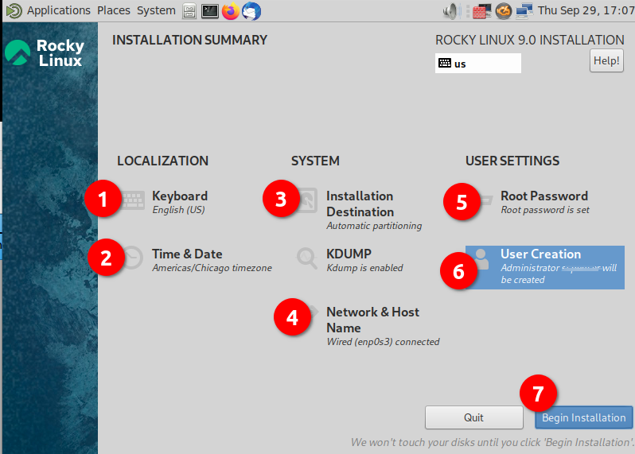
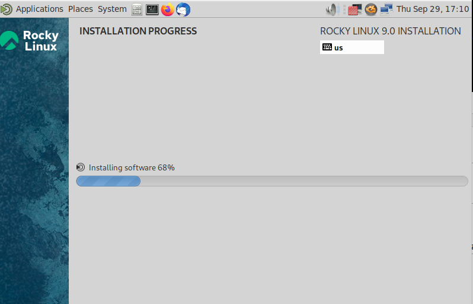
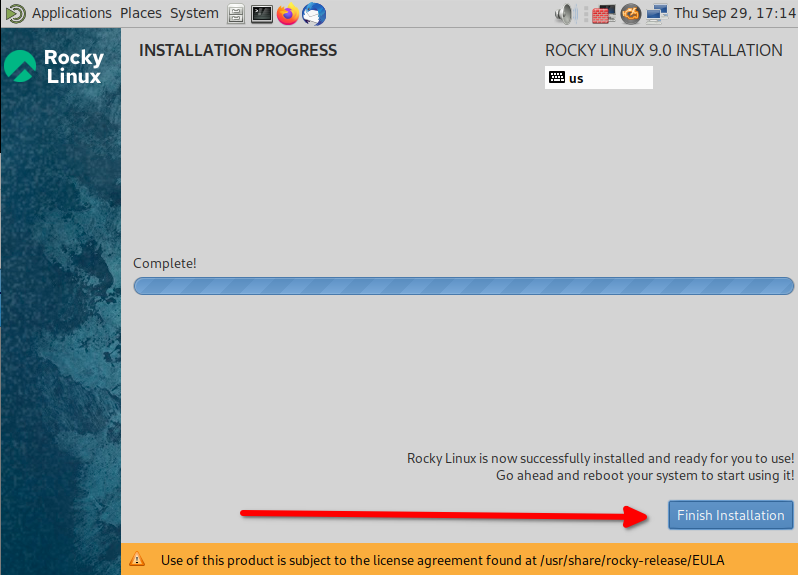
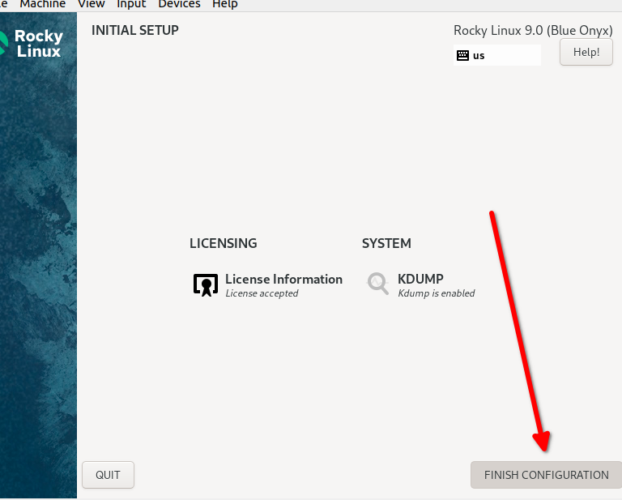
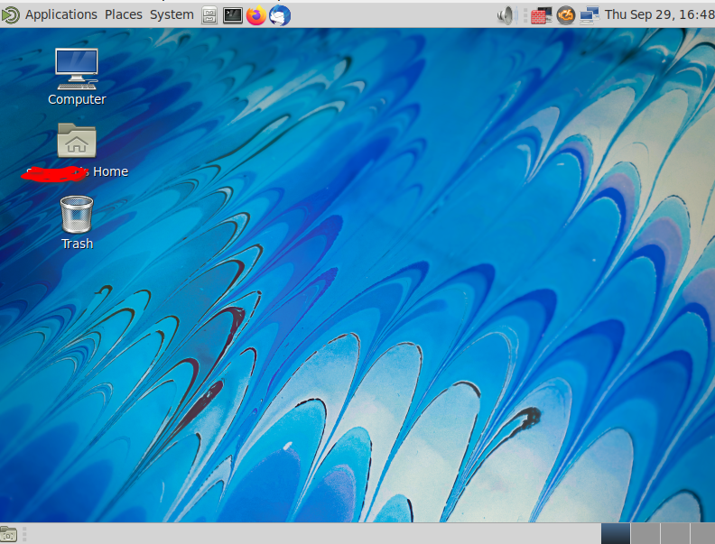

# MATE Desktop Environment

The MATE desktop environment was created to fork and continue GNOME2 in the wake of the somewhat negative reception that GNOME3 received when introduced. MATE has a loyal set of followers, who immediately install it on their OS of choice. MATE can be installed on many flavors of Linux, including Rocky Linux.

This procedure is designed to get you up and running with Rocky Linux using MATE.

## Prerequisites

* A computer (laptop or workstation) with a screen and everything.
* A desire to run the MATE desktop instead of the default GNOME one.

=== "9.0"
    
    ## 9.0: Introduction 

    The development team for Rocky Linux 9.0 have made installing MATE, and other popular desktop environments, easy by including live images. A live image, for those that may not know what that is, is a bootable image that will load the OS without installation. Once loaded, you have the option to install it to your machine's disk drive and use it. 

    ## 9.0: Get, Verify, and Write the MATE Live Image

    Prior to installation, the first step is to download the live image and write that to a DVD or a USB thumb drive. As stated earlier, the image will be bootable, just like any other installation media for Linux. You can find the latest MATE image in the download section for Rocky Linux 9 [live images](https://dl.rockylinux.org/pub/rocky/9.0/live/x86_64/). Note this particular link assumes x86_64 as your architecture, and as of this writing, that is the only architecture this particular live image is available for. Download both the live image and checksum files. 

    Now verify the image with the CHECKSUM file using the following 
    (note this is an example! Make sure your image name and 
    CHECKSUM files match): 

    ```
    sha256sum -c CHECKSUM --ignore-missing Rocky-9.0-MATE-x86_64-20220912.1.iso.CHECKSUM
    ```

    If all goes well, you should receive this message:

    ```
    Rocky-9.0-MATE-x86_64-20220912.1.iso: OK
    ```
    
    If the checksum for the file returns OK, you are now ready to write your ISO image to your media. This procedure is different by the OS you are using, the media, and the tools. We are assuming here that you know how to write the image to your media.

    ## 9.0: Booting

    This again is different by machine, BIOS, OS, etc.  You'll need to make sure that your machine is set to boot to whatever your media is (DVD or USB) as the first boot device. You should be presented with this screen if you are successful: 

    

    If so, you are on your way! If you want to test the media, you can select that option first, or you can simply type **S** to **Start Rocky Linux Mate 9.0.**

    Remeber, this is a live image, so it's going to take a bit of time to boot to the first screen. Don't panic-just wait! Once the live image is booted up, you should see this screen:

    

    ## 9.0: Installing MATE

    At this point, you can use the MATE environment and see if you like it. Once you've decided that you would like to use it permanently, double-click the option to **Install to Hard Drive.**

    This will start a pretty familiar installation process for those who have installed Rocky Linux before. In the following screen, we've highlighted things that you *may* wish to change.

    

    1. **Keyboard** Take a look at this option and make sure that it matches up to the keyboard layout that you use.
    2. **Time & Date**  Make sure this matches up to your time zone.
    3. **Installation Destination** You'll need to click into this option, even if it is just to accept what is already there.
    4. **Network & Host Name** Verify that you have what you want here. As long as the network is enabled, you can always change this later if you need to.
    5. **Root Password** Go ahead and set a root password. Remember to save this somewhere safe (password manager), particularly if it isn't something you will be using often.
    6. **User Creation** Definitely create at least one user. If you want the user to have administrative rights, remember to set this option when creating the user. 
    7. **Begin Installation** Once all of the settings have been set or verified, go ahead and click this option.

    Once you do step 7, the installation process should start installing packages, as in the below screenshot:

    

    After the installatin to the hard drive is complete, you'll be faced with the following screen:

    

    Go ahead and click **Finish Installation**

    At this point the OS will reboot, and you should remove your boot media. When the OS comes up for the first time, there is a licensing agreement screen:

    

    Go ahead and click the **I accept license agreement** check box, and then click **Done.** This will get you to the final screen as far as the installation is concerned. On this screen, click **Finish Configuration**.

    

    Next you will get a login screen with the user you created above. Go ahead and enter your password, which will get you to the MATE desktop:

    

    ## 9.0: Conclusion

    For those that do not like the typical GNOME installed desktop environment, there are many options available. One of the most popular options is MATE, and the Rocky Linux 9.0 developers have made it easy for you to install the OS and Desktop using the MATE live image.

=== "8.6"

    ## 8.6: Install Rocky Linux Minimal

    When installing Rocky Linux, we used the following sets of packages:

    * Minimal
    * Standard

    ## 8.6: Enabling Repositories

    You need the Powertools repository and the EPEL. Go ahead and enable those now:

    ```
    sudo dnf config-manager --set-enabled powertools
    sudo dnf install epel-release
    ```

    And answer 'Y' to install the EPEL.

    Go ahead and run `dnf update` to make sure all of the enabled repositories are read into the system.

    ## 8.6: Installing Packages

    The next thing we need are a lot of packages. You can install these by simply copying and pasting the following into the command line on your machine:

    ```
    sudo dnf install NetworkManager-adsl NetworkManager-bluetooth NetworkManager-libreswan-gnome NetworkManager-openvpn-gnome NetworkManager-ovs NetworkManager-ppp NetworkManager-team NetworkManager-wifi NetworkManager-wwan abrt-desktop abrt-java-connector adwaita-gtk2-theme alsa-plugins-pulseaudio atril atril-caja atril-thumbnailer caja caja-actions caja-image-converter caja-open-terminal caja-sendto caja-wallpaper caja-xattr-tags dconf-editor engrampa eom firewall-config gnome-disk-utility gnome-epub-thumbnailer gstreamer1-plugins-ugly-free gtk2-engines gucharmap gvfs-afc gvfs-afp gvfs-archive gvfs-fuse gvfs-gphoto2 gvfs-mtp gvfs-smb initial-setup-gui libmatekbd libmatemixer libmateweather libsecret lm_sensors marco mate-applets mate-backgrounds mate-calc mate-control-center mate-desktop mate-dictionary mate-disk-usage-analyzer mate-icon-theme mate-media mate-menus mate-menus-preferences-category-menu mate-notification-daemon mate-panel mate-polkit mate-power-manager mate-screensaver mate-screenshot mate-search-tool mate-session-manager mate-settings-daemon mate-system-log mate-system-monitor mate-terminal mate-themes mate-user-admin mate-user-guide mozo network-manager-applet nm-connection-editor p7zip p7zip-plugins pluma seahorse seahorse-caja xdg-user-dirs-gtk
    ```

    This will install these needed packages plus all of the dependencies.

    Let's go ahead and install lightdm-settings and lightdm as well:

    ```
    sudo dnf install lightdm-settings lightdm
    ```

    ## 8.6: Final Steps

    Now that we have everything we need installed, the next thing we need to do is set the minimal install to boot into the Graphical User Interface (GUI). We can do this by entering:

    ```
    sudo systemctl set-default graphical.target
    ```

    Now just keep your fingers crossed and reboot:

    ```
    sudo reboot
    ```

    Next, click on your user name on the screen, but before you enter your password and login, click on the gear icon to the left of the "Sign in" option. Select "MATE" from the available desktop choices and then you can enter your password and login. Future logins will remember your selection.

    ## 8.6: Conclusion

    Some people are not satisfied with the newer GNOME implementations or simply prefer the older MATE GNOME 2 look and feel. For those people, getting MATE installed in Rocky Linux will provide a nice, stable alternative.
