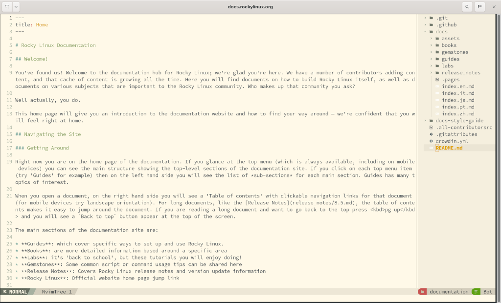
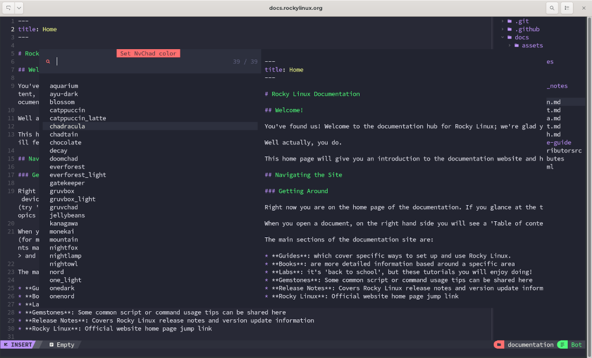
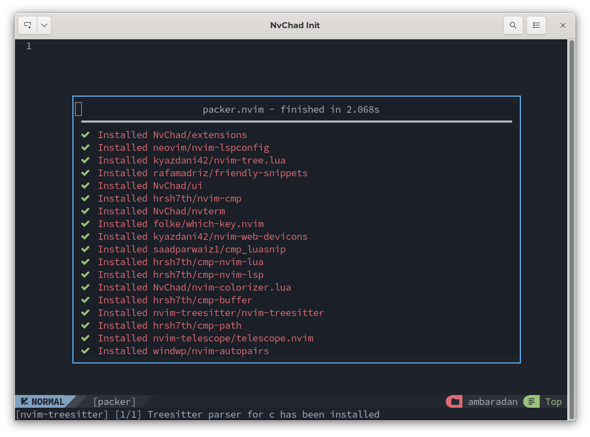
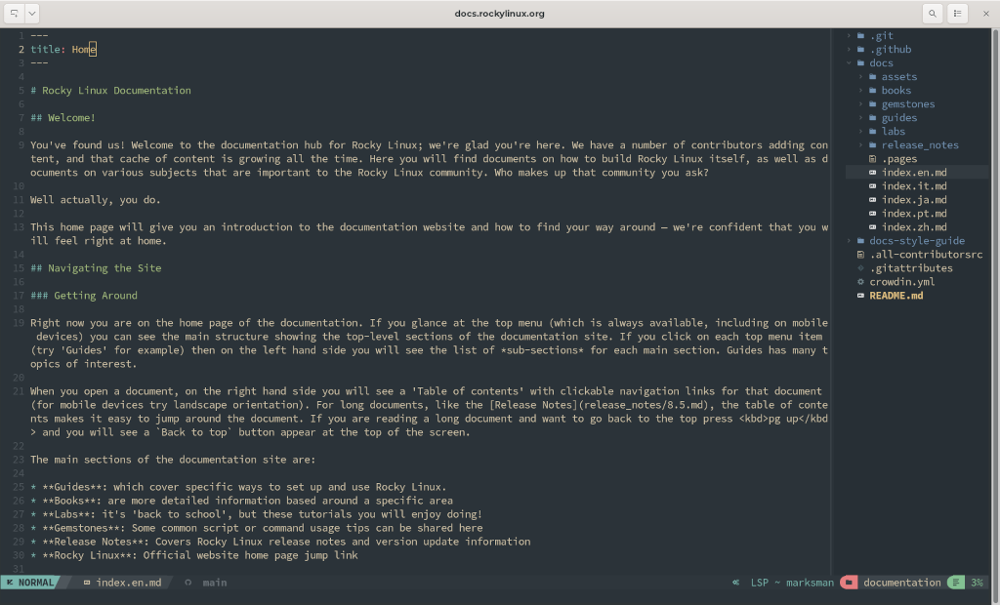

## Using Neovim as an IDE

Nvchad is a project created for the purpose of providing through a custom configuration of Neovim a starting point on which to build your own IDE (Integrated Development Environment) with minimal effort.

The configuration is written in Lua, a very fast programming language that allows NvChad to have very fast startup and execution times for commands and keystrokes. This is also made possible by the `Lazy loading` technique used for plugins that allows plugins to load only when required.

The interface turns out to be very clean and pleasant.

As the developers of NvChad are keen to point out, the project is only intended to be a base on which to build your own personal IDE. Subsequent customization is done through the use of plugins.



### Main Features

- **Designed to be fast.** From the choice of programming language to techniques for loading components everything is designed to minimize execution time.

- **Attractive Interface.** Despite being a _cli_ application the interface looks modern and beautiful graphically, plus all the components fit the UI perfectly.

- **Extremely Configurable.** Due to the modularity derived from the base used (NeoVim) the editor can be adapted perfectly to one's needs. Keep in mind, however, that when we talk about customization we are referring to functionality not to the appearance of the interface.

- **Automatic update mechanism.** The editor comes with a mechanism (through the use of _git_) that allows updating with a simple `<escape>uu` command.

- **Powered by Lua.** NvChad's configuration is written entirely in _lua_, which allows it to integrate seamlessly into Neovim's configuration by taking advantage of the full potential of the editor on which it is based.

- **Numerous inbuilt themes.** The configuration already includes a large number of themes to use, always keeping in mind that we are talking about a _cli_ application, themes can be selected with the `<escape>th` key.



## Install NvChad

### Pre-requisites

- A machine running Rocky Linux, the guide was written using Rocky Linux 9 but version 8.6 should also be supported.
- Neovim 0.7.2, this is the minimum version required. EPEL provides an outdated version but the required version can be installed from the precompiled package.
- A Nerd Font for your terminal, this allows you to have fonts representing various icons (folders, tasks, etc.). Installation will be covered at the end of this document.
- A basic knowledge of Vim, this is perhaps the most important requirement since all operations are performed by the _statusline_ in the form of text commands, it should be noted that NvChad already implements some functionality involving mouse integration but basic knowledge of the commands is essential.

#### Semi-Optional

- ripgrep, this component is considered optional but to have the full functionality of `:Telescope` is strongly recommended.

## Installation of Neovim

### Installation from EPEL

Before moving on to the installation of NvChad we need to make sure that we have an installation of Neovim available, in case it is not already installed you can install it from the EPEL Repository, even if the version provided does not meet the minimum requirements.

To install the Neovim release provided by EPEL, we install if you have not already done so the repository.

```bash
dnf install epel-release
```

And we type the following command to install the application:

```bash
dnf install neovim
```

### Installation from Precompiled Package

In order to meet the minimum requirements of NvChad, it is possible to install the precompiled package provided by Neovim this allows to solve the problem of the version provided by EPEL (currently 0.7.0.1) which does not meet the minimum requirement.

In order to use all the features of the new version we still have to satisfy the dependencies required by Neovim, so if we decide to remove or not install the outdated version at all we have to provide _our_ `nvim` with the dependencies manually. The required packages can be installed with:

```bash
dnf install compat-lua-libs libtermkey libtree-sitter libvterm luajit luajit2.1-luv msgpack unibilium xsel
```

First we download the compressed archive for our architecture (linux64), from this address:

```text
https://github.com/neovim/neovim/releases
```

The file to be downloaded is `nvim-linux64.tar.gz`, to verify the integrity of the archive we also download the file `nvim-linux64.tar.gz.sha256sum`, once downloaded we need to verify its integrity and unpack it somewhere in our `home directory`. The proposed solution is to unpack it in `~/.local/share/`, assuming we downloaded it in _/home/user/downloads/_ we will need to run the following commands:

```bash
sha256sum -c /home/user/downloads/nvim-linux64.tar.gz.sha256sum
nvim-linux64.tar.gz: OK

tar xvzf /home/user/downloads/nvim-linux64.tar.gz
mv /home/user/downloads/nvim-linux64 ~/.local/share/nvim-linux64
```

All that remains at this point is to create a symbolic link in `~/.local/bin/` for our _nvim_.

```bash
cd ~/.local/bin/
ln -sf ~/.local/share/nvim-linux64/bin/nvim nvim
```

To be shure we check the version provided by the `nvim -v` command, which should now show:

```txt
nvim -v
NVIM v0.7.2
Build type: Release
LuaJIT 2.1.0-beta3
Compiled by runner@fv-az164-457

Features: +acl +iconv +tui
See ":help feature-compile"

   system vimrc file: "$VIM/sysinit.vim"
  fall-back for $VIM: "/share/nvim"

Run :checkhealth for more info
```

## Installation of NvChad

Now that we have the basic editor installed we can move on to installing NvChad. This is actually not a real installation but rather writing a custom Neovim configuration into our user configuration.

To do this, simply run the following command from any location within your _home directory_ (Git of course needs to be installed):

``` bash
git clone https://github.com/NvChad/NvChad ~/.config/nvim --depth 1 && nvim
```

The command runs a clone of the NvChad configuration hosted on GitHub in the user folder `~/.config/nvim`, if the folder is already present it is replaced by the NvChad folder.

To finish the configuration you need to open a terminal and start an instance of `nvim`, in this first startup the plugins that are part of the default configuration will be installed and configured and when finished you will have the IDE ready for editing.



## Installing Nerd Fonts

Nerd Fonts is a collection of modified fonts aimed at developers with a large number of glyphs (icons). In particular, "iconic fonts" such as Font Awesome, Devicons, Octicons etc. are used to add extra glyphs.

Nerd Fonts takes the most popular programming fonts and modifies them by adding a group of glyphs. A font patcher is also available if the desired font has not already been edited. A convenient preview is also available at the site, allowing you to see how the font should look in the editor.  For more information, see [Nerd Fonts](https://www.nerdfonts.com/).

Fonts are available for download at:

```text
https://www.nerdfonts.com/font-downloads
```

The procedure for installing fonts on Rocky Linux is to save the fonts you want to add somewhere and then install them with the `fc-cache` command; the procedure is not a true installation so much as a registration of the new fonts in the system.

For this guide we will use the `Sauce Code Pro Nerd` font.

Download the package with:

```bash
https://github.com/ryanoasis/nerd-fonts/releases/download/v2.1.0/SourceCodePro.zip
```

We unzip the contents of the folder and copy the fonts to `~/.local/share/fonts/` with:

```bash
mkdir ~/.local/share/fonts
unzip SourceCodePro.zip -d ~/.local/share/fonts/
fc-cache ~/.local/share/fonts
```

At this point the _font nerd_ should be available for selection; to select it you must refer to the desktop you are using.

 

To change the font in the terminal emulator if you are using the default Rocky Linux desktop (Gnome) you will just need to open `gnome-terminal` go to Preferences and set the Nerd Font for your profile.

The terminal font should change and NvChad should look better.



