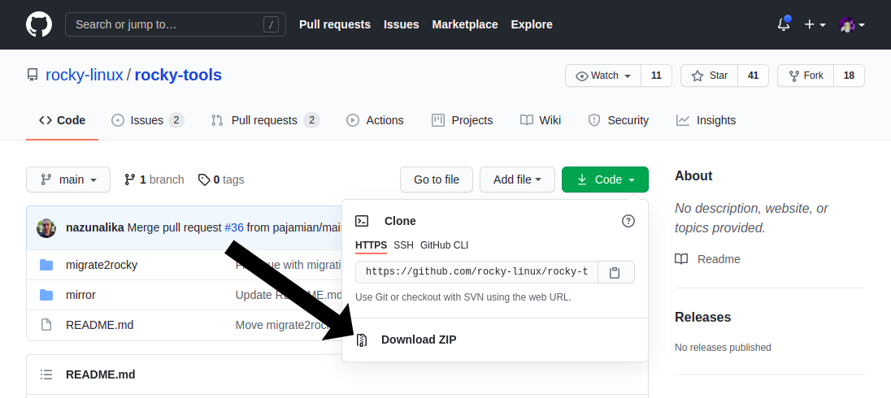
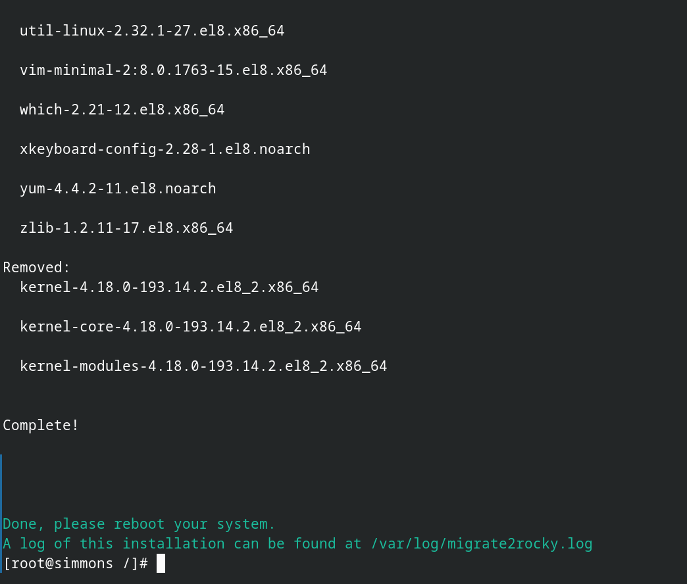

# 如何从CentOS Stream、Centos、Alma Linux、RHEL或Oracle Linux迁移到Rocky Linux

## 所需的条件与假设

* 运行着Centos、Alma Linux、RHEL或者Oracle Linux的硬件服务器或VPS，它们的版本统一为8.5。
* 了解Linux的命令行知识
* 了解SSH远程知识
* 温和的冒险态度
* 所有的命令都应该以 root 身份运行。要么以 root 身份登陆，要么每次输入命令行前键入"sudo"

## 介绍

在本指南中，您将学习如何将上面列出的所有发行版操作系统转换为功能齐全的Rocky Linux，这可能是在各种情况下迁移到Rocky Linux的最佳方法之一。

例如，一些服务器提供商在一段时间内默认不支持Rocky Linux ；或者您可能在生产环境下有一台服务器，希望在不重新安装所有内容的情况下，将其转换为Rocky Linux。

是的，我们为您准备了工具 [migrate2rocky](https://github.com/rocky-linux/rocky-tools/tree/main/migrate2rocky)

这是一个脚本，当执行时，会将您的存储库更改为Rocky Linux的存储库，软件包将根据需要进行安装和升级/降级。

如果您是新手系统管理员，别担心，我们会尽可能的保持此脚本界面的友好性。是的，就像命令行那样的友好。

### 注意事项与警告

1. 请查看  migrate2rocky 的 README 页面（上面链接），希望您知道列出的已知问题。随着时间的推移，我们很可能会发现（并最终修复）更多的冲突与不兼容性。
2. 此脚本最有可能在全新安装时正常工作。**如果要在实际的生产环境下使用，请先做好数据备份以及系统快照，或者在临时的测试环境中进行。**

准备好了吗？让我们开始吧！

## 准备你的服务器

您可以通过多种方式从存储库中获取脚本文件。

### 手动方式

从 GitHub 下载压缩文件并提取您需要的文件（即 *migrate2rocky.sh*）。您可以在存储库主页的右侧找到这个zip 文件：



然后，通过在本地计算机上运行以下命令，使用`scp`命令将可执行文件上传到您的服务器：

```
scp PATH/TO/FILE/migrate2rocky.sh root@yourdomain.com:/home/
```

根据需要，你需要调整所在的文件路径以及服务器域名或ip地址

### git方式

首先在您的服务器上安装git：

```
shell > dnf install git
```

clone克隆远程库：

```
shell > git clone https://github.com/rocky-linux/rocky-tools.git
```

注:这种方式将下载rocky-tools远程库的所有脚本与文件

### 简单但不太安全的方式

这不一定是最好的方式，但胜在简单，存在一定的安全性问题，希望您知道。

运行以下命令将脚本下载到您当前所在的目录下：

```
curl https://raw.githubusercontent.com/rocky-linux/rocky-tools/main/migrate2rocky/migrate2rocky.sh -o migrate2rocky.sh
```

该命令会将文件直接下载到您的服务器，并且*只*会下载您想要的文件。但同样还需要说明的是——有一些安全问题表明这不一定是最好的做法，所以要记住这一点。

## 执行脚本与安装

使用`cd`命令切换到脚本所在的目录，确认该文件是可执行的，给脚本文件的所有者赋予 x 的权限。

```
shell > chmod u+x migrate2rocky.sh
```

现在，执行脚本与对应选项

```
shell > ./migrate2rocky.sh -r
```

"-r" 选项表示安装所有内容

如果您做对了，终端窗口看起来像这样：


现在，脚本需要一段时间来转换所有内容，具体取决于实际机器的硬件性能与网络连接情况。

如果您最后看到 **Complete!** 消息，则表示一切正常，重启服务器即可。



给它一定的时间重启，重新登录，键入 `hostnamectl`即可检查您的操作系统是否一切正常的迁移。


