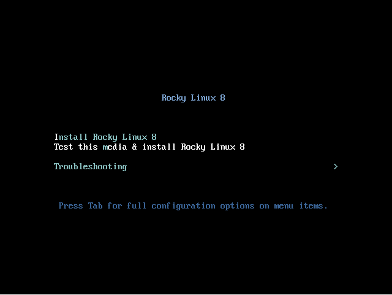

# Rocky Linuxのインストール

このガイドでは、64ビット版のrocky Linux ディストリビューションをスタンドアロンシステムにインストールするための詳細な手順を説明しています。

****

この章では、rockyプロジェクトのウェブサイトからダウンロードしたオペレーティングシステムのインストーライメージを使って、サーバークラスのインストールを行います。次のセクションでは、インストールとカスタマイズの手順を説明します。

****

## OSインストールの前提条件

まず、これからインストールするRockyのISOをダウンロードする必要があります。

今回のインストールで使用するRockyのバージョンの最新のISOイメージは、こちらからダウンロードできます。

```
https://www.rockylinux.org/download/
```

コマンドラインから直接ISOをダウンロードするには、次のように入力します。

```
$ wget https://download.rockylinux.org/pub/rocky/8.4/isos/x86_64/Rocky-8.4-x86_64-minimal.iso
```

Rocky ISOは、この慣例に従って命名されています。

```
Rocky-<MAJOR#>.<MINOR#>.<ARCH>-<VARIANT>.iso
```

例   `Rocky-8.4-x86_64-minimal.iso`

> **NOTE:**
> ロッキープロジェクトのWebページには、世界中にあるいくつかのミラーのリストがあります。可能な限り、地理的に最も近いミラーを選択してください。公式ミラーのリストは [ここ](https://mirrors.rockylinux.org/mirrormanager/mirrors)にあります。

## インストーラISOの検証

既存の Linux ディストリビューションで Rocky の ISO をダウンロードした場合、`sha256sum` ユーティリティーを使って、ダウンロードしたファイルが壊れていないかどうかを確認することができます。ここでは、`Rocky-8.4-x86_64-minimal.iso`のsha256sumを検証する例を紹介します。

まず、利用可能なISOの公式チェックサムを含んだファイルをダウンロードします。ダウンロードしたロッキーのISOが入っているフォルダに入ったまま、次のように入力します。

```
wget http://download.rockylinux.org/pub/rocky/8.4/isos/x86_64/CHECKSUM
```

`sha256sum` ユーティリティーを使って、次のように検証します。

```
sha256sum -c CHECKSUM --ignore-missing Rocky-8.4-x86_64-minimal.iso
```

出力には以下が含まれるはずです。

```
Rocky-8.4-x86_64-minimal.iso: OK
```

> **TIP:**
> インストールを開始する前に、システムのUEFI(Unified Extensible Firmware Interface)またはBIOS(Basic Input/Output System)が正しいメディアから起動するようにあらかじめ設定しておく必要があります。

# インストール

それでは早速、インストールを始めましょう。

インストールメディア（光ディスク、USBメモリーなど）を挿入して起動します。

起動すると、歓迎のスプラッシュ画面が表示されます。



何もキーを押さないでいると、プロンプトがカウントダウンを始め、その後、ハイライトされた`Test this media & install Rocky Linux 8` ... オプションを起動することにより、インストールプロセスが開始されます。<kbd>enter</kbd>を押してすぐにプロセスを開始することもできます。

簡単なメディア検証ステップが行われます。このメディア検証ステップは、インストールを開始したものの、途中でインストールメディアが悪いためにインストーラーが中断することに気づくというトラブルを防ぐことができます。

メディアチェックが完了し、メディアが正常に使用できることが確認されると、インストーラーは自動的に次の画面に進みます。

この画面では、インストールを行う際に使用する言語を選択します。この例では、_English (United States)_ を選択します。そして、<kbd>Continue</kbd>ボタンをクリックします。

# インストールサマリー

_Installation Summary_ 画面は、インストールするOSに関する重要な決定を行うためのオールインワンエリアです。

この画面は大まかに以下のセクションに分かれています。

- _Localization_: (キーボード、言語サポート、時間と日付)
- _Software_: (インストールソースとソフトウェアの選択)
- _System_: (インストール先、ネットワークとホスト名)

次にそれぞれのセクションを掘り下げ、必要に応じて変更を加えていきます。

## ローカライズセクション

このセクションでは、システムのロケールに関連する項目をカスタマイズします。ここでは、キーボード、言語サポート、時刻と日付などを設定します。

### キーボード

本ガイドのデモシステムでは、デフォルトの値（_English US_）を受け入れ、変更は行いません。

しかし、ここに変更を加える必要がある場合は、_Installation Summary_ 画面で<kbd>Keyboard</kbd>オプションをクリックし、システムのキーボードレイアウトを指定します。次の画面で必要に応じてキーボードレイアウトを追加し、その順番を指定することができます。

完了したら <kbd>Done</kbd> をクリックします。

### 言語サポート

_Installation Summary_ 画面の<kbd>Language Support</kbd>オプションでは、完成したシステムで必要となる追加の言語のサポートを指定することができます。

ここでは、デフォルトの値（__English - United States__）を受け入れ、変更しません。<kbd>Done</kbd>をクリックします。

### 時刻と日付

メインの _Installation Summary_ 画面で <kbd>Time & Date</kbd> オプションをクリックすると、マシンが設置されているタイムゾーンを選択するための別画面が表示されます。地域や都市のリストをスクロールして、最も近い地域を選択してください。

インストール元によっては、_Network Time_ オプションがデフォルトで_ON_または_OFF_に設定されている場合があります。これにより、NTP（Network Time Protocol）を使ってシステムが自動的に正しい時刻を設定します。変更したら<kbd>Done</kbd>をクリックします。

## ソフトウェアセクション

インストールの概要」画面の「ソフトウェア」セクションでは、インストール元のほか、追加でインストールされるパッケージ（アプリケーション）を選択できます。

### インストールソース

ここではロッキー8のフルイメージを使ってインストールするので、メインの _Installation Summary_ 画面のInstall Sourceセクションでは、 _Local Media_ が自動的に指定されていることに気づきます。ここでは、あらかじめ設定されているデフォルト値を使用します。

### ソフトウェアの選択

メインの _Installation Summary_ 画面で <kbd>Software Selection</kbd> オプションをクリックすると、システムにインストールされるソフトウェアパッケージを選択できるセクションが表示されます。ソフトウェアの選択エリアは以下のように分かれています。

- _基本環境_：サーバー、最小インストール、カスタムOS
- _Additional software for Selected Environment area_ : 左側のBase Environmentを選択すると、右側にその環境にインストール可能な様々な関連追加ソフトウェアが表示されます。

_Minimal Install_(基本機能)を選択します。

画面上部の<kbd>Done</kbd>をクリックします。

##システムセクション

インストールの概要」画面の「システム」セクションは、ターゲットシステムの基本的なハードウェアをカスタマイズしたり、変更したりするために使用します。ここでは、ハードドライブのパーティションやボリュームの作成、使用するファイルシステムの 指定、ネットワーク構成の指定などを行います。

### インストール先

インストールの概要」画面で、<kbd>インストール先</kbd>のオプションをクリックします。これにより、対応するタスクエリアに移動します。

インストール先の候補となるディスクドライブが表示されます。今回のサンプルシステムのように、システム上にディスクドライブが1つしかない場合は、「Local Standard Disks」の下にドライブが表示され、その横にチェックマークが付いています。ディスクのアイコンをクリックすると、ディスク選択のチェックマークのオン/オフが切り替わります。ここではチェックを入れておきましょう。

_Storage Configuration_ Options "セクションで、<kbd>Automatic</kbd>ラジオボタンを選択します。

そして、画面上部の<kbd>Done</kbd>をクリックします。

インストーラが使用可能なディスクがあると判断すると、_Installation Summary_ 画面に戻ります。

### ネットワークとホスト名

インストール手順の最後のタスクであるネットワーク設定では、システムのネットワーク関連の設定や調整を行います。

> **NOTE:**  <kbd>ネットワークとホスト名</kbd>オプションをクリックすると、正しく検出されたすべてのネットワークインターフェースハードウェア（イーサネットやワイヤレスネットワークカードなど）が、ネットワーク設定画面の左ペインに一覧表示されます。Linux ディストリビューションやハードウェアの設定によって、Linux のイーサネットデバイスは、`eth0`, `eth1`, `ens3`, `ens4`, `em1`, `em2`, `p1p1`, `enp0s3` などのような名前になります。

各インターフェイスには、DHCPを使って設定するか、手動でIPアドレスを設定することができます。手動で設定する場合は、IPアドレスやネットマスクなどの関連情報をすべて用意しておいてください。

メインの _Installation Summary_ 画面で<kbd>Network & Hostname</kbd>ボタンをクリックすると、対応する設定画面が表示されます。とりわけ、システムのホスト名を設定するオプションがあります（名前のデフォルトは `localhost.localdomain` です）。

> **NOTE:**
> この名前は、OSがインストールされた後で簡単に変更することができます。現時点では、ホスト名に与えられたデフォルト値を受け入れてください。

次の重要な設定作業は、システムのネットワークインターフェースに関するものです。まず、左側のペインにイーサネットカード（または任意のネットワークカード）が表示されていることを確認します。左ペインで検出されたネットワークデバイスのいずれかをクリックして選択します。選択したネットワークアダプターの設定可能なプロパティが画面の右ペインに表示されます。

> **NOTE:**
> サンプルサーバーには、4つのイーサネットデバイス（`ens3`, `ens4`, `ens5`, `ens6`）があり、いずれも接続状態になっています。お使いのシステムのネットワークデバイスの種類、名前、数量、状態は、今回のサンプルシステムのものとは異なる可能性があります。

設定したいデバイスのスイッチが右ペインで「ON」の位置に反転していることを確認してください。
このセクションでは、すべてのデフォルトを受け入れます。

<kbd>Done</kbd>をクリックすると、_Installation Summary_ のメイン画面に戻ります。

> **CAUTION:**
> このインストーラーのこのセクションでは、サーバーのIPアドレスに注意してください。システムに物理的または簡単なコンソールアクセスがない場合、この情報は後でサーバーに接続して作業を続ける必要があるときに便利です。

## インストール

様々なインストール作業の選択に満足したら、次の段階では、インストールが適切に開始されます。

## ユーザー設定セクション

このセクションでは、`root` ユーザーアカウントのパスワードを作成したり、管理者や非管理者のアカウントを新たに作成する際に使用します。

### ルートパスワードの設定

ユーザー設定の _Root Password_ フィールドをクリックして、_Root Password_ タスク画面を起動します。_Root Password_ のテキストボックスに、ルートユーザーの強力なパスワードを設定します。

> **WARNING:**
> このユーザーは、システム上で最も権限のあるアカウントです。そのため、使用する場合、または有効にする場合には、このアカウントを非常に優れたパスワードで保護することが重要です。

_Confirm_ のテキストボックスに同じパスワードを再度入力します。

<kbd>Done</kbd>をクリックします。

### ユーザーアカウントの作成

次に、_User Settings_ の _User Creation_ フィールドをクリックすると、 _Create User_ タスク画面が起動します。このタスクエリアでは、システム上に特権的または非特権的（非管理者）なユーザーアカウントを作成することができます。

> **INFO:**
> システム上の日常的な作業のために非特権アカウントを作成して使用することは、システム管理の良い習慣です。

ここでは、必要に応じてスーパーユーザー（管理者）の権限を呼び出せる一般ユーザーを作成します。

_Create User_ 画面のフィールドに以下の情報を入力し、<kbd>Done</kbd>をクリックしてください。

_Full name_:
`rockstar`

_Username_:
`rockstar`

_Make this user administrator_:
Checked

_Require a password to use this account_:
Checked

_Password_:
`04302021`

_Confirm password_:
`04302021`

### インストールの開始

さまざまなインストール作業の選択に問題がなければ、メインの _Installation Summary_ 画面で Begin Installation ボタンをクリックしてください。インストールが開始され、インストーラーにインストールの進捗状況が表示されます。

> **NOTE:**
> 「Begin Installation」ボタンをクリックした後に怖気づいてしまった場合でも、データ（または自尊心）を失うことなく、安全にインストールを中止することができます。インストーラを終了するには、Quit ボタンをクリックするか、キーボードの ctrl-alt-del を押すか、リセットスイッチや電源スイッチを押すかして、システムをリセットしてください。

インストールが始まると、ディスクのパーティション分割、パーティションや LVM ボリュームのフォーマット、ソフトウェアの依存関係の確認と解決、ディスクへのオペレーティングシステムの書き込みなど、さまざまなタスクがバックグラウンドで実行されます。  

### インストールの完了

必須のサブタスクのいずれかを完了し、インストーラーが一巡すると、完了メッセージを含む最終的なインストールの進行画面が表示されます。

最後に、<kbd>Reboot System</kbd>ボタンをクリックして、すべての手順を完了します。システムの再起動が行われます。

### ログイン

これでシステムの設定が完了し、使用できるようになりました。可愛らしいRocky Linuxのコンソールが表示されます。


システムにログインするには、ログインプロンプトで`rockstar`と入力し、<kbd>enter</kbd>を押します。

Passwordプロンプトで、`04302021`（rockstarのパスワード）と入力し、<kbd>enter</kbd>を押します（画面には何も表示されませんが、これは正常です）。

ログイン後に`whoami`コマンドを実行します。


