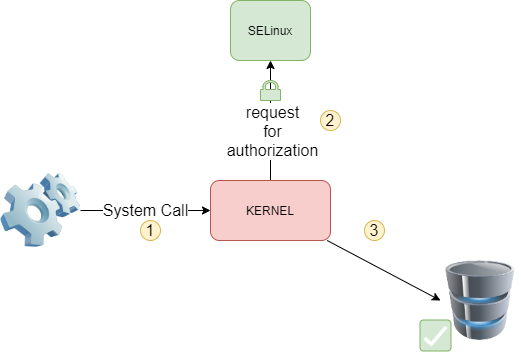
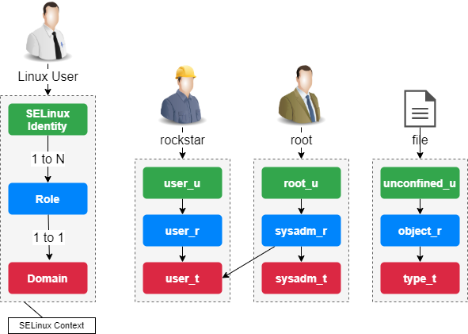
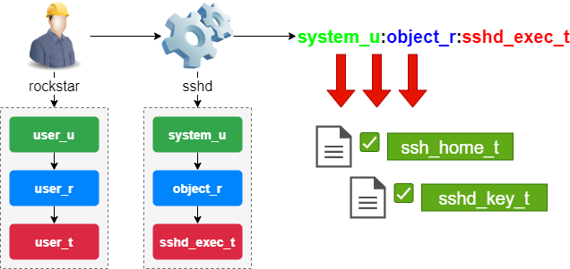

# Sicurezza SELinux

Con l'arrivo del kernel versione 2.6, è stato introdotto un nuovo sistema di sicurezza per fornire un meccanismo di sicurezza a supporto delle politiche per il controllo di sicurezza dell'accesso.

Questo sistema si chiama **SELinux** (**S**ecurity **E**nhanced **Linux**) ed è stato creato dalla **NSA** (**N**ational **S**ecurity **A**dministration) per implementare una robusta **M**andatory **A**ccess **C**ontrol (**MAC**) nei sottosistemi Linux del kernel.

Se, durante tutta la tua carriera, hai disabilitato o ignorato SELinux, questo documento sarà una buona introduzione a questo sistema. SELinux lavora per limitare i privilegi o rimuovere i rischi associati alla compromissione di un programma o un demone.

Prima di iniziare, dovresti sapere che SELinux è destinato principalmente alle distribuzioni RHEL, anche se è possibile implementarlo su altre distribuzioni come Debian (ma buona fortuna!). Le distribuzioni della famiglia Debian integrano generalmente il sistema AppArmor, che funziona diversamente da SELinux.

## Generalità

**SELinux** (Security Enhanced Linux) è un sistema Mandatory Access Control.

Prima della comparsa dei sistemi MAC, la sicurezza di gestione degli accessi standard era basata su sistemi **DAC** (**D**iscretionary **A**ccess **C**ontrol). Un'applicazione, o un demone gestito con diritti **UID** o **SUID** (**S**et **O**wner **U**ser **I**d) che ha il permesso di valutare le autorizzazioni (file, socket e altri processi..) corrispondenti a quell'utente. Questa operazione non limita a sufficienza i diritti di un programma corrotto, consentendole potenzialmente di accedere ai sottosistemi del sistema operativo.

Un sistema MAC rafforza la separazione delle informazioni di riservatezza e integrità nel sistema per ottenere un sistema di contenimento. Il sistema di contenimento è indipendente dal sistema tradizionale dei diritti e non esiste alcuna nozione di superutente.

Con ogni chiamata di sistema, il kernel interroga SELinux per vedere se permette di eseguire l'azione.



SELinux utilizza un insieme di regole (policies) per questo. Viene fornito un insieme di due set di regole standard (**targeted** e **strict**) e ogni applicazione di solito fornisce le proprie regole.

### Il contesto SELinux

Il funzionamento di SELinux è totalmente diverso dai tradizionali diritti Unix.

Il contesto di sicurezza SELinux è definito dal trio **identity**+**role**+**domain**.

L'identità di un utente dipende direttamente dal suo account Linux. A un'identità è assegnato uno o più ruoli, ma ad ogni ruolo corrisponde un dominio, e uno solo.

È in base al settore del contesto di sicurezza (e quindi al ruolo) che vengono valutati i diritti di un utente su una risorsa.



I termini "dominio" e "tipo" sono simili. Tipicamente "dominio" viene utilizzato quando si riferisce a un processo, mentre "tipo" si riferisce a un oggetto.

La convenzione dei nomi è: **user_u:role_r:type_t**.

Il contesto di sicurezza è assegnato a un utente al momento della sua connessione, in base ai suoi ruoli. Il contesto di sicurezza di un file è definito dal comando `chcon` (**ch**ange **con**text), che vedremo più avanti in questo documento.

Considerare i seguenti pezzi del puzzle SELinux:

* Gli argomenti
* Gli oggetti
* Le politiche
* La modalità

Quando un oggetto (un'applicazione per esempio) cerca di accedere a un oggetto (un file per esempio), la parte SELinux del kernel Linux interroga il suo database di criteri. A seconda della modalità di operazione, SELinux autorizza l'accesso all'oggetto in caso di successo, altrimenti registra il fallimento nel file `/var/log/messages`.

#### Il contesto SELinux dei processi standard

I diritti di un processo dipendono dal suo contesto di sicurezza.

Per impostazione predefinita, il contesto di sicurezza del processo è definito dal contesto (identità + ruolo + dominio) dell'utente che lo avvia.

Un dominio che è un tipo specifico (nel senso SELinux) collegato a un processo ed ereditato (normalmente) dall'utente che lo ha lanciato, i suoi diritti sono espressi in termini di autorizzazione o rifiuto su tipi collegati agl oggetti:

Un processo il cui contesto ha la sicurezza __dominio D__ può accedere a oggetti di __tipo T__.


#### Il contesto SELinux di processi importanti

I programmi più importanti sono assegnati un dominio dedicato.

Ogni eseguibile è etichettato con un tipo dedicato (qui **sshd_exec_t**) che passa automaticamente il processo associato al contesto **sshd_t** (invece di **user_t**).

Questo meccanismo è essenziale in quanto limita il più possibile i diritti di un processo.



## Gestione

Il comando `semanage` viene utilizzato per gestire le regole SELinux.

```
semanage [object_type] [options]
```

Esempio:

```
$ semanage boolean -l
```

| Opzioni | Osservazioni        |
| ------- | ------------------- |
| -a      | Aggiunge un oggetto |
| -d      | Elimina un oggetto  |
| -m      | Modifica un oggetto |
| -l      | Elenca gli oggetti  |

Il comando `semanage` potrebbe non essere installato di default in Rocky Linux.

Senza conoscere il pacchetto che fornisce questo comando, si dovrebbe cercare il suo nome con il comando:

```
dnf provides */semanage
```

quindi installarlo:

```
sudo dnf install policycoreutils-python-utils
```

### Amministrazione degli oggetti Booleani

I booleani consentono il contenimento dei processi.

```
semanage boolean [options]
```

Per elencare i Booleani disponibili:

```
semanage boolean –l
SELinux boolean    State Default  Description
…
httpd_can_sendmail (off , off)  Allow httpd to send mail
…
```

!!! Note "Nota"

    Come puoi vedere, c'è uno stato `default` (ad esempio all'avvio) e uno stato in esecuzione.

Il comando `setsebool` viene utilizzato per cambiare lo stato di un oggetto booleano:

```
setsebool [-PV] boolean on|off
```

Esempio:

```
sudo setsebool -P httpd_can_sendmail on
```

| Opzioni | Osservazioni                                                             |
| ------- | ------------------------------------------------------------------------ |
| `-P`    | Cambia il valore predefinito all'avvio (altrimenti solo fino al riavvio) |
| `-V`    | Elimina un oggetto                                                       |

!!! Warning "Attenzione"

    Non dimenticare l'opzione `-P` per mantenere lo stato dopo il prossimo avvio.

### Amministrazione degli oggetti Port

Il comando `semanage` viene utilizzato per gestire oggetti di tipo port:

```
semanage port [options]
```

Esempio: abilita la porta 81 per i processi di dominio httpd

```
sudo semanage port -a -t http_port_t -p tcp 81
```

## Modalità operative

SELinux ha tre modalità operative:

* Enforcing

Modalità predefinita per Rocky Linux. L'accesso sarà limitato secondo le norme in vigore.

* Permissive

Le regole sono interrogate, gli errori di accesso sono registrati, ma l'accesso non sarà bloccato.

* Disabled

Nulla sarà limitato, niente sarà registrato.

Per impostazione predefinita, la maggior parte dei sistemi operativi sono configurati con SELinux in modalità Enforcing.

Il comando `getenforce` restituisce la modalità operativa corrente

```
getenforce
```

Esempio:

```
$ getenforce
Enforcing
```

Il comando `sestatus` restituisce informazioni su SELinux

```
sestatus
```

Esempio:

```
$ sestatus
SELinux status:                enabled
SELinuxfs mount:                 /sys/fs/selinux
SELinux root directory:    /etc/selinux
Loaded policy name:        targeted
Current mode:                enforcing
Mode from config file:     enforcing
...
Max kernel policy version: 33
```

Il comando `setenforce` cambia la modalità operativa corrente:

```
setenforce 0|1
```

Passa a SELinux in modalità permissiva:

```
sudo setenforce 0
```

### Il file `/etc/sysconfig/selinux`

Il file `/etc/sysconfig/selinux` consente di modificare la modalità operativa di SELinux.

!!! Warning "Attenzione"

    La disattivazione di SELinux è fatta a proprio rischio! È meglio imparare come funziona SELinux che disabilitarlo sistematicamente!

Modifica il file `/etc/sysconfig/selinux`

```
SELINUX=disabled
```

!!! Note "Nota"

    `/etc/sysconfig/selinux` è un collegamento simbolico a `/etc/selinux/config`

Riavviare il sistema:

```
sudo reboot
```

!!! Warning "Attenzione"

    Attenzione al cambiamento della modalità SELinux!

In modalità permissiva o disabilitata, i nuovi file creati non avranno alcuna etichetta.

Per riattivare SELinux, dovrai riposizionare le etichette sull'intero sistema.

Etichettatura dell'intero sistema:

```
sudo touch /.autorelabel
sudo reboot
```

## Il Tipo di Policy

SELinux fornisce due tipi standard di regole:

* **Targeted**: solo i demoni di rete sono protetti (`dhcpd`, `httpd`, `named`, `nscd`, `ntpd`, `portmap`, `snmpd`, `squid` e `syslogd`)
* **Strict**: tutti i demoni sono protetti

## Contesto

La visualizzazione dei contesti di sicurezza viene eseguita con l'opzione `-Z`. È associata a molti comandi:

Esempi:

```
id -Z   # the user's context
ls -Z   # those of the current files
ps -eZ  # those of the processes
netstat –Z # for network connections
lsof -Z # for open files
```

Il comando `matchpathcon` restituisce il contesto di una directory.

```
matchpathcon directory
```

Esempio:

```
sudo matchpathcon /root
 /root  system_u:object_r:admin_home_t:s0

sudo matchpathcon /
 /      system_u:object_r:root_t:s0
```

Il comando `chcon` modifica un contesto di sicurezza:

```
chcon [-vR] [-u USER] [–r ROLE] [-t TYPE] file
```

Esempio:

```
sudo chcon -vR -t httpd_sys_content_t /data/websites/
```

| Opzioni        | Osservazioni                         |
| -------------- | ------------------------------------ |
| `-v`           | Passa in modalità dettagliata        |
| `-R`           | Applica ricorsione                   |
| `-u`,`-r`,`-t` | Si applica a un utente, ruolo o tipo |

Il comando `restorecon` ripristina il contesto di sicurezza predefinito (quello fornito dalle regole):

```
restorecon [-vR] directory
```

Esempio:

```
sudo restorecon -vR /home/
```

| Opzioni | Osservazioni                  |
| ------- | ----------------------------- |
| `-v`    | Passa in modalità dettagliata |
| `-R`    | Applica ricorsione            |

Per far sopravvivere un cambio di contesto a un `restorecon`, è necessario modificare i contesti dei file predefiniti con il comando `semanage fcontext`:

```
semanage fcontext -a options file
```

!!! Note "Nota"

    Se si esegue un cambio di contesto per una cartella che non è standard per il sistema, creare la regola e quindi applicare il contesto è una buona prassi, come nell'esempio qui sotto!

Esempio:

```
$ sudo semanage fcontext -a -t httpd_sys_content_t "/data/websites(/.*)?"
$ sudo restorecon -vR /data/websites/
```

## comando `audit2why`

Il comando `audit2why` indica la causa di un rifiuto di SELinux:

```
audit2why [-vw]
```

Esempio per ottenere la causa dell'ultimo rifiuto da parte di SELinux:

```
sudo cat /var/log/audit/audit.log | grep AVC | grep denied | tail -1 | audit2why
```

| Opzioni | Osservazioni                                                                                                       |
| ------- | ------------------------------------------------------------------------------------------------------------------ |
| `-v`    | Passa in modalità dettagliata                                                                                      |
| `-w`    | Traduce la causa di un rifiuto da parte di SELinux e propone una soluzione per porvi rimedio (opzione predefinita) |

### Andando oltre con SELinux

Il comando `audit2allow` crea un modulo per consentire un'azione SELinux (quando non esiste un modulo) da una riga in un file "audit":

```
audit2allow [-mM]
```

Esempio:

```
sudo cat /var/log/audit/audit.log | grep AVC | grep denied | tail -1 | audit2allow -M mylocalmodule
```

| Opzioni | Osservazioni                                                |
| ------- | ----------------------------------------------------------- |
| `-m`    | Creare solo il modulo (`*.te`)                              |
| `-M`    | Creare il modulo, compilarlo e creare il pacchetto (`*.pp`) |

#### Esempio di configurazione

Dopo l'esecuzione di un comando, il sistema restituisce il prompt dei comandi ma il risultato atteso non è visibile: nessun messaggio di errore sullo schermo.

* **Passo 1**: Leggi il file di log sapendo che il messaggio a cui siamo interessati è di tipo AVC (SELinux), rifiutato (denied) e il più recente (quindi l'ultimo).

```
sudo cat /var/log/audit/audit.log | grep AVC | grep denied | tail -1
```

Il messaggio è isolato correttamente, ma non ci aiuta.

* **Passo 2**: Leggi il messaggio isolato con il comando `audit2why` per ottenere un messaggio più esplicito che potrebbe contenere la soluzione del nostro problema (tipicamente un booleano da impostare).

```
sudo cat /var/log/audit/audit.log | grep AVC | grep denied | tail -1 | audit2why
```

Ci sono due casi: o possiamo inserire un contesto o riempire un booleano, o dobbiamo andare al terzo passo per creare il nostro contesto.

* **Passo 3**: Crea il tuo modulo.

```
$ sudo cat /var/log/audit/audit.log | grep AVC | grep denied | tail -1 | audit2allow -M mylocalmodule
Generating type enforcement: mylocalmodule.te
Compiling policy: checkmodule -M -m -o mylocalmodule.mod mylocalmodule.te
Building package: semodule_package -o mylocalmodule.pp -m mylocalmodule.mod

$ sudo semodule -i mylocalmodule.pp
```
