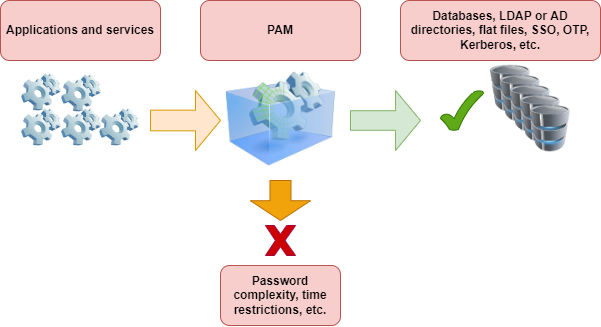
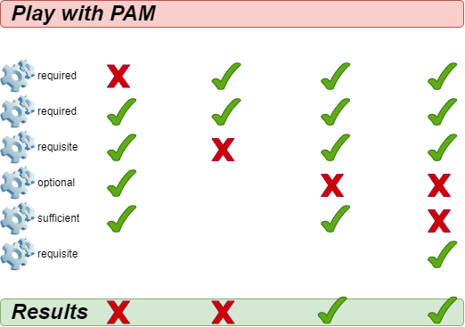

# PAM authentication modules

PAM (**Pluggable Authentication Modules**) is the system under GNU/Linux that allows many applications or services to authenticate users centrally.

> PAM is a suite of libraries that allows a Linux system administrator to configure methods to authenticate users. It provides a flexible and centralized way to switch authentication methods for secured applications by using configuration files instead of changing application code. ([wikipedia](https://en.wikipedia.org/wiki/Linux_PAM))

## Generalities

Authentication is the phase during which it is verified that you are the person you claim to be. There are other forms of authentication besides the use of passwords.



The implementation of a new authentication method should not require changes in the configuration or source code of a program or service.

This is why applications rely on PAM, which will provide them with the primitives necessary to authenticate their users.

All the applications in a system can thus implement complex functionalities such as **SSO** (Single Sign On), **OTP** (One Time Password) or **Kerberos** in a completely transparent manner.

A system administrator can choose exactly the authentication policy for a single application (e.g. to harden the SSH service) independently of the application.

Each application or service supporting PAM will have a corresponding configuration file in the `/etc/pam.d` directory. For example, the process `login` assigns the name `/etc/pam.d/login` to its configuration file.

!!! WARNING

    A wrong configuration of PAM can compromise the whole security of your system.

    PAM is an authentication system (password management). If PAM is vulnerable then the whole system is vulnerable.

### Syntax of a directive

A directive is used to set up an application for PAM.

```
mechanism [control] path-to-module [argument]
```

For example the file `/etc/pam.d/sudo`:

```
#%PAM-1.0
auth       include     system-auth
account    include     system-auth
password   include     system-auth
session    optional    pam_keyinit.so revoke
session	   required    pam_limits.so
```

A **directive** (a complete line) is composed of a **mechanism** (`auth`, `account`, `password` or `session`), a **success check** (`include`, `optional`, `required`, ...), the **path to the module** and possibly **arguments** (like `revoke` for example).

!!! WARNING

    The order of the modules is very important!

Each PAM configuration file contains a set of directives. The module interface directives can be stacked or placed on top of each other.

In fact, the order in which the modules are listed is very important to the authentication process.

## The mechanisms

### The auth mechanism - Authentication

Concerns the authentication of the requester and establishes the rights of the account:

* Usually authenticates with a password by comparing it to a value stored in a database or by relying on an authentication server,

* Establishes account settings: uid, gid, groups and resource limits.

### The account mechanism - Account management

Check that the requested account is available:

* Relates to the availability of the account for reasons other than authentication (e.g. for time restrictions).

### The session mechanism - Session management

Relates to session setup and termination:

* Perform tasks associated with session setup (e.g., logging),
* Perform tasks associated with session termination.

### The password mechanism - Password management

Used to modify the authentication token associated with an account (expiration or change):

* Changes the authentication token and possibly verifies that it is robust enough or that it has not already been used.

## Control indicators

The PAM mechanisms (`auth`, `account`, `session` and `password`) indicate `success` or `failure`. The control flags (`required`, `requisite`, `sufficient`, `optional`) tell PAM how to handle this result.

### The control indicator required

Successful completion of all `required` modules is necessary.

* If the module passes:

The rest of the chain is executed. The request is allowed unless other modules fail.

* If the module fails:

The rest of the chain is executed. Finally the request is rejected.

The module must be successfully verified for the authentication to continue. If the verification of a module marked required fails, the user is not notified until all modules associated with that interface have been verified.

### The control indicator requisite

Successful completion of all `requisite` modules is necessary.

* If the module passes:

The rest of the chain is executed. The request is allowed unless other modules fail.

* If the module fails:

The request is immediately rejected.

The module must be successfully verified for authentication to continue. However, if the verification of a requisiteite module fails, the user is immediately notified by a message indicating the failure of the first required or requisite module.

### The control indicator sufficient

Passing one `sufficient` module is sufficient.

* If the module succeeds:

The request is immediately allowed if none of the previous modules failed.

* If the module fails:

The module is ignored. The rest of the chain is executed.

If the module fails, the module checks are ignored. However, if a module check marked `sufficient` is successful and no previous modules marked `required` or `requisite` have failed, no further modules of that type are required and the user will be authenticated to the service.

### The control indicator optional

The module is executed but the result of the request is ignored.

If all modules in the chain were marked `optional`, all requests would always be accepted.

### Conclusion



## The PAM modules

There are many modules for PAM. Here are the most common ones:

* pam_unix
* pam_ldap
* pam_wheel
* pam_cracklib
* pam_console
* pam_tally
* pam_securetty
* pam_nologin
* pam_limits
* pam_time
* pam_access

### The pam_unix module

The `pam_unix` module allows to manage the global authentication policy.

File `/etc/pam.d/system-auth`:

```
password sufficient pam_unix.so sha512 nullok
```

Arguments are possible for this module:

* `nullok`: in the `auth` mechanism allows an empty login password.
* `sha512`: in the password mechanism, defines the encryption algorithm.
* `debug`: to send information to `syslog`.
* `remember=n`: to remember the last `n` passwords used (works in conjunction with the `/etc/security/opasswd` file, which is to be created by the administrator).

### The pam_cracklib module

The `pam_cracklib` module allows to test passwords.

File `/etc/pam.d/password-auth`

```
password sufficient pam_cracklib.so retry=2
```

This module uses the `cracklib` library to check the strength of a new password. It can also check that the new password is not built from the old one. It only concerns the password mechanism.

By default this module checks the following aspects and rejects if this is the case:

* is the new password from the dictionary?
* is the new password a palindrome of the old one (e.g.: azerty <> ytreza)?
* only the case of the character(s) varies (e.g.: azerty <>AzErTy)?

Possible arguments for this module:

* `retry=n`: imposes `n` requests (1` by default) for the new password.
* `difok=n`: imposes at least `n` characters (`10` by default) different from the old password. Moreover if half of the characters of the new password are different from the old one, the new password is validated.
* `minlen=n`: imposes a password of `n+1` characters minimum not taken into account below `6` characters (module compiled as such!).

Other possible arguments :

* `dcredit=-n`: imposes a password containing at least `n` digits,
* `ucredit=-n`: imposes a password containing at least `n` capital letters,
* `credit=-n`: imposes a password containing at least `n` lower case letters,
* `ocredit=-n`: imposes a password containing at least `n` special characters.

### The pam_tally module

The `pam_tally` module allows you to lock an account based on a number of unsuccessful login attempts.

File `/etc/pam.d/system-auth`:

```
auth required /lib/security/pam_tally.so onerr=fail no_magic_root
account required /lib/security/pam_tally.so deny=3 reset no_magic_root
```

The `account` mechanism increments the counter.

The `auth` mechanism accepts or denies authentication and resets the counter.

Some arguments of the pam_tally module are interesting to use:

* `onerr=fail`: increment the counter,
* `deny=n`: once the number `n` of unsuccessful attempts is exceeded, the account is locked,
* `no_magic_root`: include or not the daemons managed by root (avoid locking root),
* `reset`: reset the counter to `0` if the authentication is validated,
* `lock_time=nsec`: the account is locked for `n` seconds.

This module works together with the default file of unsuccessful attempts `/var/log/faillog` (which can be replaced by another file with the argument `file=xxxx`) and the associated command `faillog`.

Syntax of the faillog command:

```
faillog[-m n] |-u login][-r]
```

Options:

* `m`: to define, in the command display, the maximum number of unsuccessful attempts,
* `u`: to specify a user,
* `r`: to unlock a user.

### The pam_time module

The `pam_time` module allows to limit the access times to services managed by PAM.

File `/etc/pam.d/system-auth`:

```
account required /lib/security/pam_time.so
```

The configuration is done via the file `/etc/security/time.conf`.

File `/etc/security/time.conf`:

```
login ; * ; users ;MoTuWeThFr0800-2000
http ; * ; users ;Al0000-2400
```

The syntax of a directive is as follows:

```
services; ttys; users; times
```

In the following definitions, the logical list uses:

* `&`: and logical,
* `|`: or logical,
* `!`: negation = "all except",
* `*`: wildcard character.

The columns correspond to :

* `services`: logical list of services managed by PAM that are concerned,
* `ttys`: logical list of concerned devices,
* `users`: logical list of users managed by the rule,
* `times`: logical list of authorized time slots.

How to manage time slots :

* days: Mo Tu We Th Fr Sa Su Wk (Monday to Friday) Wd (Saturday and Sunday) Al (Monday to Sunday),
* the range: HHMM-HHMM,
* a repetition cancels the effect: WkMo = all days of the week (M-F) minus Monday (repeat).

Examples:

* Bob, can login via a terminal every day between 07:00 and 09:00, except Wednesday:

```
login; tty*; bob; alth0700-0900
```

No login, terminal or remote, except root, every day of the week between 17:30 and 7:45 the next day:

```
login; tty* | pts/*; !root; !wk1730-0745
```

### The pam_nologin module

The `pam_nologin` module allows to disable all accounts except root:

File `/etc/pam.d/login`:

```
auth required pam_nologin.so
```

If the file `/etc/nologin` exists then only root can connect.

### The pam_wheel module

The `pam_wheel` module allows to limit the access to the `su` command to the members of the `wheel` group.

File `/etc/pam.d/su`:

```
auth required pam_wheel.so
```

The argument `group=my_group` limits the use of the `su` command to members of the group `my_group`

!!! NOTE

    If the group `my_group` is empty, then the `su` command is no longer available on the system, which forces the use of the sudo command.

### The pam_mount module

The `pam_mount` module allows to mount a volume for a user session.

File `/etc/pam.d/system-auth`:

```
auth optional pam_mount.so
password optional pam_mount.so
session optional pam_mount.so
```

Mount points are configured in the `/etc/security/pam_mount.conf` file:

File `/etc/security/pam_mount.conf`:

```
<volume fstype="nfs" server="srv" path="/home/%(USER)" mountpoint="~" />
<volume user="bob" fstype="smbfs" server="filesrv" path="public" mountpoint="/public" />
```


