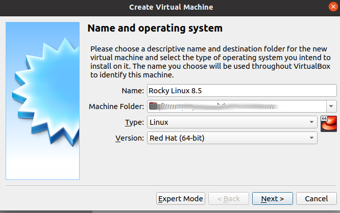
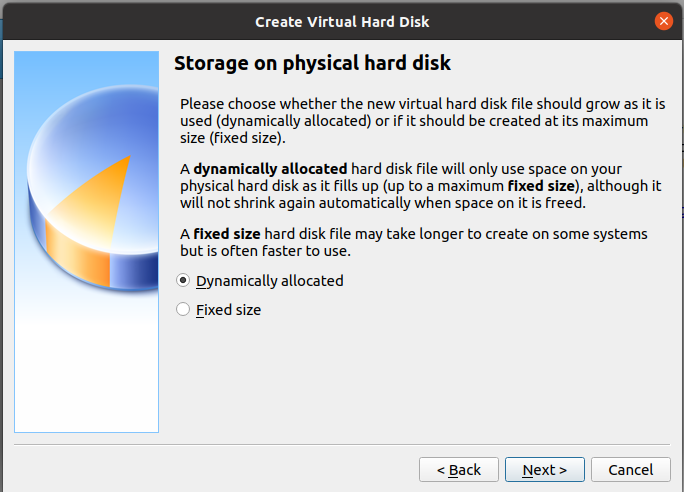
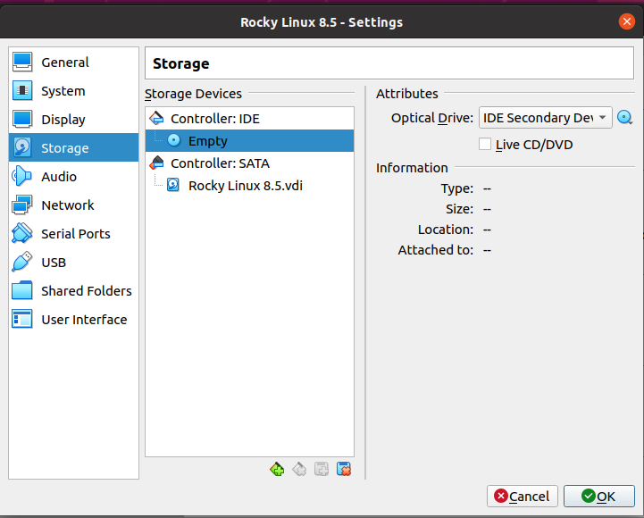
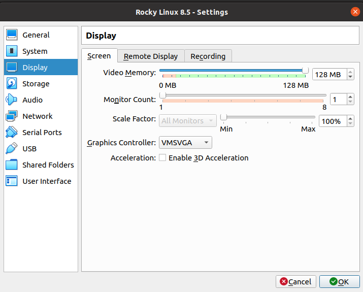

# Rocky en VirtualBox

## Introducción

VirtualBox&reg; es un poderoso producto de virtualización de uso tanto empresarial como doméstico. De vez en cuando, alguien publica que tiene problemas para ejecutar Rocky Linux en VirtualBox&reg;. Ha sido testeado múltiples veces desde el release candidate y funciona bien. Los problemas usualmente reportados son a menudo relativos al video.

Este documento intenta brindar un conjunto de instrucciones paso a paso para poner en funcionamiento Rocky Linux en VirtualBox&reg;. El ordenador utilizado para crear esta documentación ejecutaba Linux, pero puede usar cualquiera de los sistemas operativos soportados.

## Requisitos previos

* Una máquina (Windows, Mac, Linux, Solaris) con memoria disponible y espacio en el disco duro para crear y ejecutar una instancia de VirtualBox&reg;.
* VirtualBox&reg; instalado en su máquina. Puede encontrarlo [aquí](https://www.virtualbox.org/wiki/Downloads).
* Una copia del [DVD ISO](https://rockylinux.org/download) de Rocky Linux para su arquitectura. (x86_64 o ARM64).
* Asegúrese de que su sistema operativo sea de 64 bit y de que la virtualización del hardware esté habilitada en su BIOS.

!!! El comando leerá el flujo de entrada hasta que encuentre la palabra clave definida después de la redirección de entrada.

    La virtualización del hardware es 100% necesaria para instalar un sistema operativo de 64 bit. Si su pantalla de configuración muestra solo opciones de 32 bits, entonces deberá detenerse y solucionar ese problema antes de continuar.

## Preparar la configuración de VirtualBox&reg;

Una vez que haya instalado VirtualBox&reg;, el siguiente paso es ponerlo en marcha. Sin imágenes instaladas obtendrá una pantalla que se asemeja a esta:

 

 Primero, debemos indicarle a VirtualBox&reg; qué sistema operativo deseamos:

 * Haga clic en "New" (ícono de diente de sierra).
 * Escriba un nombre. Por ejemplo: "Rocky Linux 8.5".
 * Deje la carpeta de la máquina como rellenada automáticamente.
 * Cambie el tipo a "Linux".
 * Y elija °Red Hat (64-bit)".
 * Haga clic en "Next".

 

A continuación, debemos asignar algo de RAM para esta máquina. Por defecto, VirtualBox&reg; llenará automáticamente esto con 1024 MB. Eso no será óptimo para ningún sistema operativo moderno, incluido Rocky Linux. Si tiene memoria de sobra, asigne de 2 a 4 GB (2048 MB o 4096 MB), o más. Tenga en cuenta que VirtualBox&reg; solo usará esta memoria mientras la máquina virtual esté en ejecución.

No hay captura de pantalla para esto, solo cambie el valor de acuerdo a su memoria disponible. Utilice su mejor criterio.

Ahora necesitamos configurar el tamaño del disco duro. Por defecto, VirtualBox&reg; seleccionará automáticamente la opción "Create a virtual hard disk now".

* Haga clic en "Create"

Se presentará un cuadro de diálogo para crear varios tipos de discos duros virtuales, habrá varios tipos de discos duros listados allí. Consulte la documentación de Oracle VirtualBox para obtener [más información](https://docs.oracle.com/en/virtualization/virtualbox/6.0/user/vdidetails.html) sobre la selección de tipos de discos duros virtuales. A efecto de este documento, simplemente mantenga la opción predeterminada (VDI):

* Haga clic en "Next"

La siguiente pantalla abordará el almacenamiento en el disco duro físico. Hay dos opciones. "Fixed Size" será más lento de crear, más rápido de usar, pero menos flexible en términos de espacio (si necesita más espacio, estará sujeto a lo que creó).

La opción predeterminada, "Dynamically Allocated", será más rápida de crear, más lenta de usar, pero le proporcionará la opción de incremento si su espacio en disco necesita modificarse. A los efectos de este documento, aceptaremos la opción predeterminada "Dynamically allocated".

* Haga clic en "Next"

VirtualBox&reg; ahora le ofrece la opción de especificar dónde desea que se ubique el archivo del disco duro virtual, así como la opción de expandir el espacio predeterminado de 8 GB del disco duro virtual. Esta opción es buena, porque 8 GB de espacio en el disco duro no son suficientes para instalar, y mucho menos para usar, cualquiera de las opciones de instalación de la GUI. Establezca 20 GB (o más) dependiendo del uso que desea darle a la máquina virtual y del espacio libre disponible en el disco:

* Haga clic en "Create"

Hemos finalizado la configuración básica. Deberá tener una pantalla que se vea así:

## Adjuntar la imagen ISO

Nuestro próximo paso será adjuntar la imagen ISO descargada anteriormente como dispositivo de CD ROM virtual. Haga clic en "Settings" (icono de engranaje) y debería obtener la siguiente pantalla:

* Haga clic en el elemento "Storage" en el menú de la izquierda.
* En "Storage Devices" de la sección central, haga clic en el ícono del CD que dice "Empty".
* En "Attributes", sobre el lado derecho, haga clic en el icono del CD.
* Seleccione "Choose/Create a Virtual Optical Disk".
* Haga clic en el botón "Add" (icono del signo de más) y navegue hasta donde esté almacenada su imagen ISO de Rocky Linux.
* Seleccione la ISO haga clic en "Open“.

Ahora debería tener la ISO agregada a los dispositivos disponibles de esta manera:

* Marque la imagen ISO y luego haga clic en "Choose".

La imagen ISO de Rocky Linux ahora aparece seleccionada bajo el "Controller: IDE" en la sección central:

* Haga clic en "OK"

### Memoria de video para instalaciones gráficas

VirtualBox&reg; configura 16 MB de memoria para uso del video. Eso está bien si planea ejecutar un servidor mínimo sin una GUI, pero en cuanto agregue gráficos, ya no será suficiente. Los usuarios que mantienen esta configuración a menudo ven una pantalla de arranque colgada que nunca finaliza, u otros errores.

Si va a ejecutar Rocky Linux con una GUI, debe asignar la memoria suficiente para ejecutar los gráficos sin problemas. Si su máquina tiene poca memoria, ajuste este valor hacia arriba de 16 MB en 16 MB hasta que las cosas funcionen sin problemas. La resolución de video de su máquina host es también un factor que debe considerar.

Piense con cuidado en lo que quiere que haga su máquina virtual Rocky Linux e intente asignar memoria de video que sea compatible con su máquina host y sus otros requerimientos. Puede encontrar más información sobre la configuración de pantalla en la [documentación oficial de Oracle](https://docs.oracle.com/en/virtualization/virtualbox/6.0/user/settings-display.html).

Si tiene bastante memoria, puede establecer este valor en un máximo de 128 MB. Para solucionar esto antes de iniciar la máquina virtual, haga clic en "Settings" (ícono de engranaje) y debería obtener la misma pantalla de configuración que obtuvimos al adjuntar nuestra imagen ISO (arriba).

Esta vez:

* Haga clic en "Display" sobre el lado izquierdo.
* En la pestaña "Screen" sobre el lado derecho, verá la opción "Video Memory" con el valor predeterminado establecido en 16 MB.
* Cámbielo al valor que desee. Puede ajustarlo al alza volviendo a esta pantalla en cualquier momento. En nuestro ejemplo, ahora seleccionamos 128 MB.

!!! Tip

    Hay formas de establecer la memoria de video hasta 256 MB. Si necesita más, consulte [este documento] (https://docs.oracle.com/en/virtualization/virtualbox/6.0/user/vboxmanage-modifyvm.html) de la documentación oficial de Oracle.

Su pantalla debería mostrar algo similar a esto:

* Haga clic en "OK"

## Comenzar la Instalación

Hemos configurado todo para poder comenzar la instalación. Tenga en cuenta que no hay diferencias particulares en la instalación de Rocky Linux en una máquina VirtualBox&reg;, comparada con una instalación en hardware independiente. Los pasos de la instalación son los mismos.

Ahora que tenemos todo preparado para la instalación, solo necesita hacer clic en "Start" (ícono de flecha verde hacia la derecha) para comenzar a instalar Rocky. Cuando haya pasado la pantalla de selección de idioma, la siguiente será la pantalla "Installation Summary". Necesitará configurar cualquiera de los elementos que correspondan, pero los siguientes son imprescindibles:

* Fecha y hora
* Selección de software (si desea algo además del "Server with GUI" predeterminado)
* Destino de la instalación
* Red y hostname
* Configuración de usuario

Si no está seguro de alguna de estas configuraciones, consulte el documento para [Instalar Rocky](../installation.md).

Cuando haya terminado la instalación, debería tener una instancia de Rocky Linux ejecutándose en VirtualBox&reg;.

Después de instalar y reiniciar, se presentará una pantalla de acuerdo de licencia EULA que será necesario aceptar, y una vez que haya hecho clic en "Finish Configuration", debería presentarse un inicio de sesión gráfico (si elige una opción con GUI) o de línea de comando. El autor escogió la opción predeterminada "Server with GUI" para fines de demostración:

## Información adicional

No es la intención de este documento convertirlo en un experto en todas las funciones que VirtualBox&reg; puede proporcionar. Para obtener más información sobre cómo realizar tareas específicas, por favor consulte la [documetación oficial](https://docs.oracle.com/en/virtualization/virtualbox/6.0/user/).

!!! tip "Consejo Avanzado"

    VirtualBox&reg; ofrece amplias opciones en la línea de comando usando `VBoxManage`. Si bien este documento no cubre el uso de `VBoxManage`, la documentación oficial de Oracle proporciona [muchos detalles] (https://docs.oracle.com/en/virtualization/virtualbox/6.0/user/vboxmanage-intro.html) si desea investigar esto más a fondo.

## Conclusión

Es fácil crear, instalar y ejecutar una máquina Rocky Linux sobre VirtualBox&reg;. Si bien está lejos de ser una guía exhaustiva, seguir los pasos anteriores debería brindarle una instalación de Rocky Linux funcional. Si usa VirtualBox&reg; y tiene una configuración específica que le gustaría compartir, el autor lo invita a enviar nuevas secciones para este documento.
