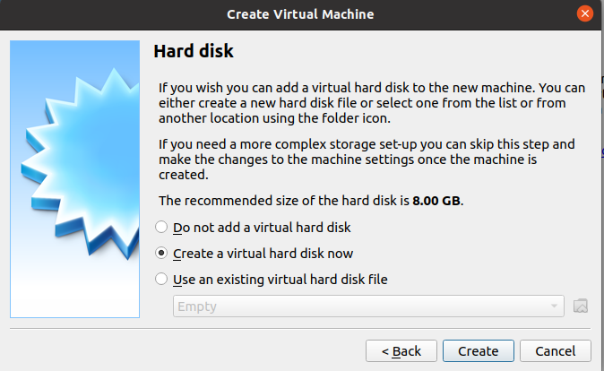
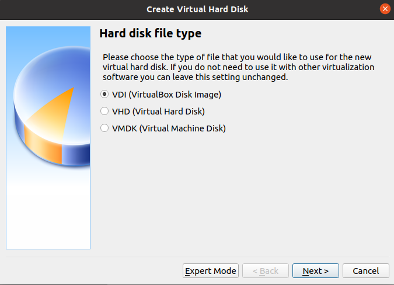
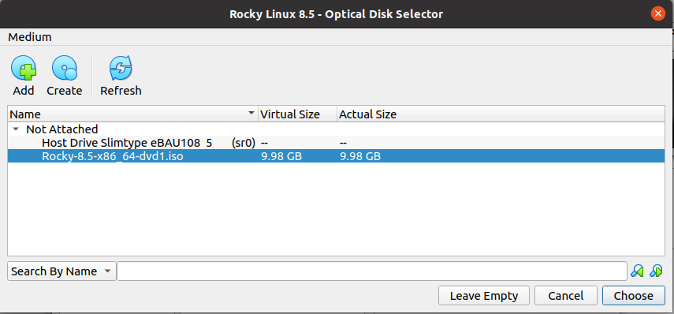

# Introduzione

VirtualBox&reg; è un potente prodotto di virtualizzazione sia per uso aziendale che domestico. Di tanto in tanto, qualcuno scrive che ha problemi a far funzionare Rocky Linux in VirtualBox&reg;. È stato testato più volte risalendo dalla release candidate, e funziona bene. I problemi che la gente riferisce di solito riguardano spesso il video.

Questo documento è un tentativo di dare una serie di istruzioni passo dopo passo per avere Rocky Linux in funzione su VirtualBox&reg;. La macchina usata per costruire questa documentazione utilizzava Linux, ma è possibile utilizzare qualsiasi sistema operativo supportato.

## Prerequisiti

* Una macchina (Windows, Mac, Linux, Solaris) con memoria disponibile e spazio su disco rigido per costruire ed eseguire l'istanza di VirtualBox&reg;.
* VirtualBox&reg; installato sulla vostra macchina. Potete trovarlo [qui](https://www.virtualbox.org/wiki/Downloads).
* Una copia del [DVD ISO](https://rockylinux.org/download) di Rocky Linux per la tua architettura. (x86_64 o ARM64).
* Assicuratevi che il vostro sistema operativo sia a 64 bit e che la virtualizzazione dell'hardware sia attivata nel BIOS.

!!! Note "Nota"

    La virtualizzazione dell'hardware è necessaria al 100% per installare un sistema operativo a 64 bit. Se la vostra schermata di configurazione mostra solo opzioni a 32 bit, allora dovete fermarvi e risolvere questo problema prima di continuare.

## Preparare la Configurazione di VirtualBox&reg;

Una volta che avete VirtualBox&reg; installato, il passo successivo è quello di avviarlo. Senza immagini installate otterrete una schermata che assomiglia a questa:

 

 Per prima cosa, dobbiamo dire a VirtualBox&reg; quale sarà il nostro sistema operativo:

 * Clicca su "Nuovo" (icona a forma di dente di sega).
 * Digita un nome. Esempio: "Rocky Linux 8.5".
 * Lascia la cartella della macchina come riempita automaticamente.
 * Cambia il tipo in "Linux".
 * E scegli "Red Hat (64-bit)".
 * Clicca "Successivo".

 

Successivamente, abbiamo bisogno di allocare un po' di RAM per questa macchina. Per default, VirtualBox&reg; riempirà automaticamente questo con 1024 MB. Questo non sarà ottimale per nessun sistema operativo moderno, incluso Rocky Linux. Se hai memoria a disposizione, alloca da 2 a 4 GB (2048 MB o 4096 MB) - o più. Tenete a mente che VirtualBox&reg; userà questa memoria solo mentre la macchina virtuale è in esecuzione.

Non c'è uno screenshot per questo, basta cambiare il valore in base alla vostra memoria disponibile. Usate il vostro miglior giudizio.

Ora dobbiamo impostare la dimensione del disco rigido. Per impostazione predefinita, VirtualBox&reg; riempirà automaticamente il pulsante radio "Creare ora un disco rigido virtuale".

* Cliccare su "Crea"

Otterrete una finestra di dialogo per la creazione di vari tipi di disco rigido virtuale, e ci sono diversi tipi di disco rigido elencati qui. Vedi la documentazione di Oracle VirtualBox per [maggiori informazioni](https://docs.oracle.com/en/virtualization/virtualbox/6.0/user/vdidetails.html) sulla selezione dei tipi di disco rigido virtuale. Per lo scopo di questo documento, basta mantenere l'impostazione predefinita (VDI):

* Clicca Su "Avanti"

La prossima schermata riguarda la memorizzazione sul disco rigido fisico. Ci sono due opzioni. "Dimensione fissa" sarà più lento da creare, più veloce da usare, ma meno flessibile in termini di spazio (se hai bisogno di più spazio, sei bloccato con quello che hai creato).

L'opzione predefinita, "Allocato dinamicamente", sarà più veloce da creare, più lenta da usare, ma vi darà la possibilità di crescere se il vostro spazio su disco deve cambiare. Per lo scopo di questo documento, accettiamo solo l'impostazione predefinita di "Allocato dinamicamente."

* Clicca Su "Avanti"

VirtualBox&reg; ora ti dà la possibilità di specificare dove vuoi che il file dell'hard disk virtuale sia situato, così come l'opzione di espandere lo spazio predefinito di 8 GB dell'hard disk virtuale. Questa opzione è buona, perché 8 GB di spazio su disco rigido non sono sufficienti per installare, e tanto meno per usare, nessuna delle opzioni di installazione della GUI. Impostatelo a 20 GB (o più) a seconda di ciò per cui volete usare la macchina virtuale e quanto spazio libero su disco avete a disposizione:

* Cliccare su "Crea"

Abbiamo finito la configurazione di base. Dovreste avere una schermata che assomiglia a questa:

## Attaccare l'immagine ISO

Il nostro prossimo passo è quello di attaccare l'immagine ISO che avete scaricato in precedenza come un dispositivo CD ROM virtuale. Clicca su "Impostazioni" (icona dell'ingranaggio) e dovresti ottenere la seguente schermata:

* Clicca sulla voce "Storage" nel menu di sinistra.
* Sotto "Dispositivi di archiviazione" nella sezione centrale, clicca sull'icona del CD che dice "Vuoto".
* Sotto "Attributi" sul lato destro, clicca sull'icona del CD.
* Selezionate "Scegliere/Creare un disco ottico virtuale".
* Fai clic sul pulsante "Aggiungi" (icona con il segno più) e naviga fino a dove è memorizzata la tua immagine ISO di Rocky Linux.
* Selezionate la ISO e cliccate su "Apri".

Ora dovreste avere la ISO aggiunta ai dispositivi disponibili in questo modo:

* Evidenzia l'immagine ISO e poi clicca su "Scegli".

L'immagine ISO di Rocky Linux appare ora selezionata sotto "Controller:IDE" nella sezione centrale:

* Clicca "OK"

### Memoria video per Installazioni Grafiche

VirtualBox&reg; imposta 16 MB di memoria da utilizzare per il video. Questo va bene se si sta progettando di eseguire un server bare-bones senza una GUI, ma non appena si aggiunge la grafica, questo non è sufficiente. Gli utenti che mantengono questa impostazione spesso vedono una schermata di avvio sospesa che non finisce mai, o altri errori.

Se avete intenzione di eseguire Rocky Linux con una GUI, dovreste allocare abbastanza memoria per eseguire facilmente la grafica. Se la vostra macchina è un po' a corto di memoria, regolate questo valore verso l'alto di 16 MB alla volta fino a quando le cose funzionano bene. La risoluzione video della vostra macchina host è anche un fattore che dovete considerare.

Pensate attentamente a ciò che volete che la vostra macchina virtuale Rocky Linux faccia, e cercate di allocare una memoria video che sia compatibile con la vostra macchina host e le vostre altre esigenze. Puoi trovare maggiori informazioni sulle impostazioni di visualizzazione nella [documentazione ufficiale di Oracle](https://docs.oracle.com/en/virtualization/virtualbox/6.0/user/settings-display.html).

Se avete molta memoria, potete impostare questo valore al massimo di 128 MB. Per risolvere questo problema prima di avviare la macchina virtuale, clicca su "Impostazioni" (icona dell'ingranaggio) e dovresti ottenere la stessa schermata di impostazioni che abbiamo ottenuto quando abbiamo attaccato la nostra immagine ISO (sopra).

Questa volta:

* Clicca su "Display" sul lato sinistro.
* Nella scheda "Schermo" sul lato destro, noterete l'opzione "Memoria video" con l'impostazione predefinita a 16 MB.
* Cambiatelo con il valore che volete. Potete regolarlo verso l'alto tornando a questa schermata in qualsiasi momento. Nel nostro esempio, stiamo selezionando 128 MB ora.

!!! Tip "Suggerimento"

    Ci sono modi per impostare la memoria video fino a 256 MB. Se avete bisogno di più, controllate [questo documento](https://docs.oracle.com/en/virtualization/virtualbox/6.0/user/vboxmanage-modifyvm.html) dalla documentazione ufficiale di Oracle.

Il tuo schermo dovrebbe essere simile a questo:

* Clicca "OK"

## Iniziare l'installazione

Abbiamo impostato tutto in modo da poter iniziare l'installazione. Si noti che non ci sono particolari differenze nell'installazione di Rocky Linux su una macchina VirtualBox&reg; rispetto all'hardware stand-alone. I passi dell'installazione sono gli stessi.

Ora che abbiamo preparato tutto per l'installazione, devi solo cliccare su "Start" (icona verde con la freccia destra) per iniziare l'installazione di Rocky. Una volta che hai cliccato oltre la schermata di selezione della lingua, la schermata successiva è quella del "Riepilogo dell'installazione". È necessario impostare tutti gli elementi che vi riguardano, ma i seguenti sono necessari:

* Data & Ora
* Selezione del software (se vuoi qualcosa oltre al "Server con GUI" di default)
* Destinazione Installazione
* Rete & Nome Host
* Impostazioni dell'utente

Se non sei sicuro di qualcuna di queste impostazioni, fai riferimento al documento [Installazione di Rocky](../installazione.md).

Una volta terminata l'installazione, dovreste avere un'istanza di VirtualBox&reg; di Rocky Linux in esecuzione.

Dopo l'installazione e il riavvio si otterrà una schermata di accordo di licenza EULA che è necessario accettare, e una volta cliccato su "Finish Configuration", si dovrebbe ottenere un login grafico (se avete scelto un'opzione GUI) o a riga di comando. L'autore ha scelto il "Server con GUI" di default per scopi dimostrativi:

## Altre informazioni

Non è l'intento di questo documento di farvi diventare un esperto di tutte le caratteristiche che VirtualBox&reg; può fornire. Per informazioni su come fare cose specifiche, controlla la [documentazione ufficiale](https://docs.oracle.com/en/virtualization/virtualbox/6.0/user/).

!!! tip "Suggerimento avanzato"

    VirtualBox&reg; offre ampie opzioni dalla riga di comando usando `VBoxManage`. Mentre questo documento non copre l'uso di `VBoxManage`, la documentazione ufficiale di Oracle fornisce [molti dettagli] (https://docs.oracle.com/en/virtualization/virtualbox/6.0/user/vboxmanage-intro.html) se volete fare ulteriori ricerche.

## Conclusione

È facile creare, installare ed eseguire una macchina VirtualBox&reg; Rocky Linux. Anche se non si tratta di una guida esaustiva, seguire i passi di cui sopra dovrebbe permettervi di installare Rocky Linux. Se usi VirtualBox&reg; e hai una configurazione specifica che vorresti condividere, l'autore ti invita a presentare nuove sezioni a questo documento.
